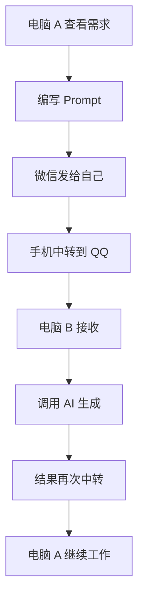
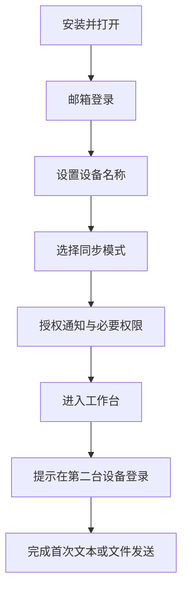
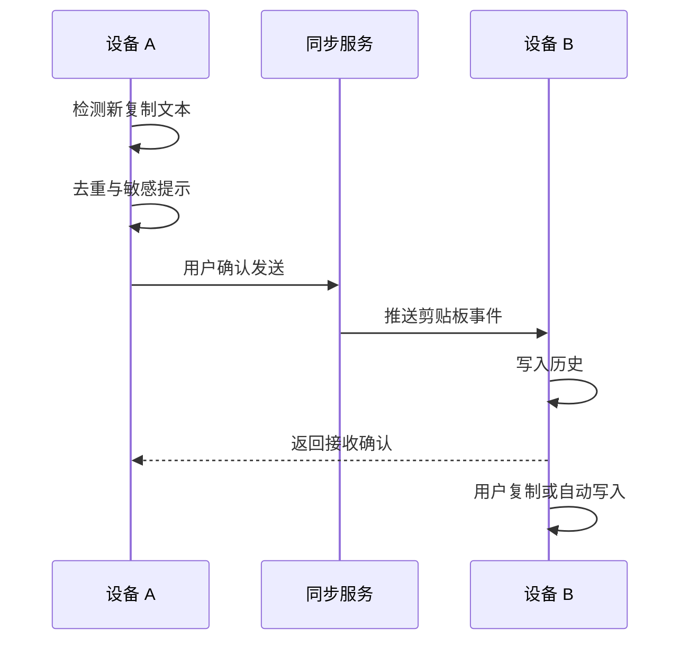
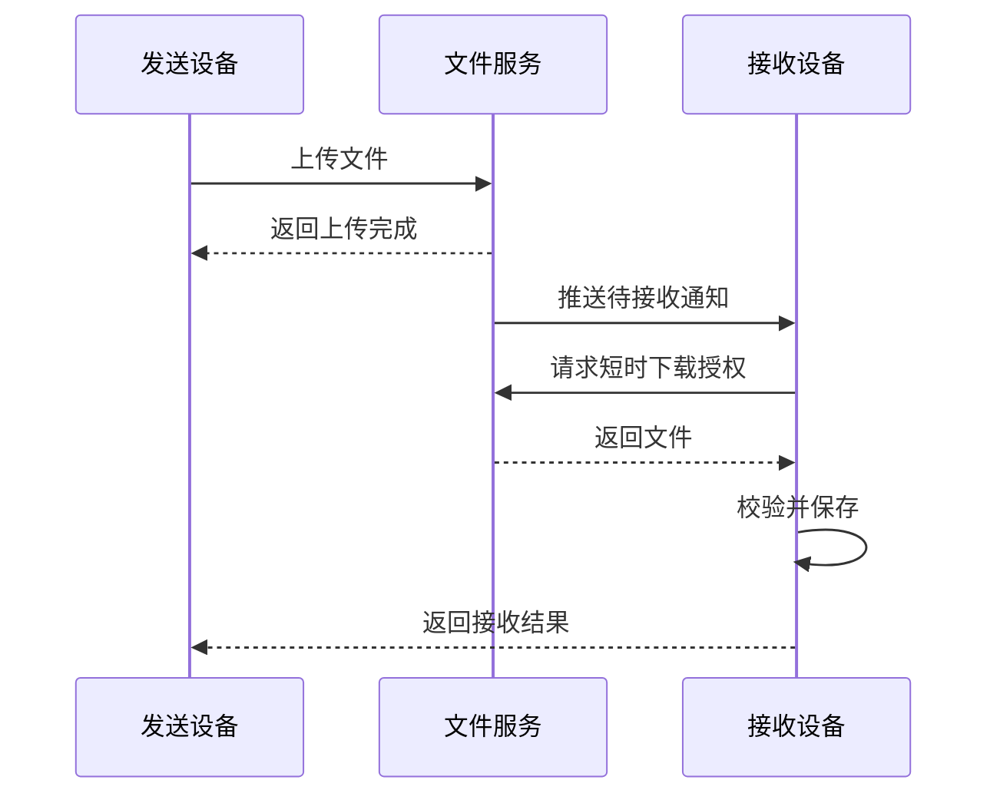
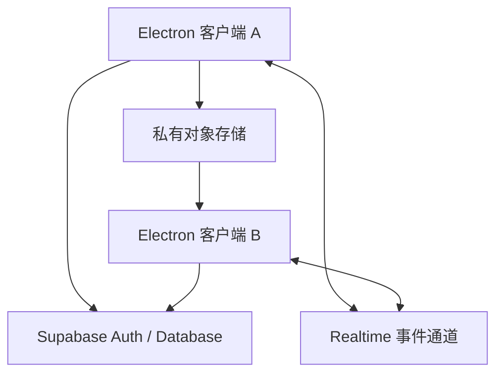
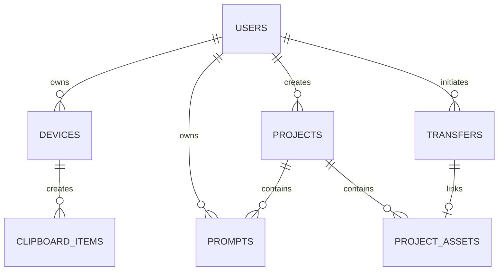
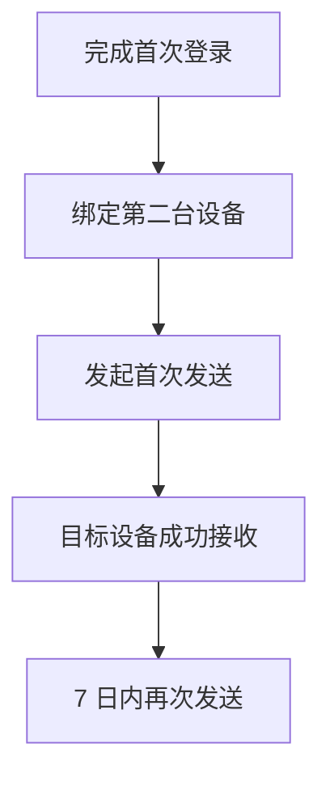

# FlowBridge 产品需求文档（PRD）

> **产品名称：** FlowBridge  
> **中文名称：** 流桥（暂定）  
> **产品定位：** AI 跨设备工作流助手  
> **英文标语：** Make Multiple Computers Feel Like One.  
> **文档版本：** V1.0  
> **产品版本：** MVP V0.1  
> **文档状态：** 可进入产品设计与技术评审  
> **创建日期：** 2026-07-30  
> **目标平台：** Windows 优先，macOS 次之  

---

## 0. 文档说明

### 0.1 文档目的

本文档用于明确 FlowBridge MVP 的产品定位、目标用户、核心场景、功能范围、交互逻辑、数据结构、验收标准及技术约束，作为产品、设计、开发和测试共同执行的依据。

### 0.2 版本原则

MVP 不追求一次性建设完整的“AI Workspace Hub”，而是优先验证一个高频且可闭环的核心价值：

> 用户能否在两台电脑之间，无需微信、QQ 和手机中转，连续完成“复制 Prompt—发送素材—AI 生成—取回结果—继续修改”的工作流。

### 0.3 关键名词

| 名词 | 定义 |
|---|---|
| 设备 | 安装并登录 FlowBridge 的一台电脑 |
| 在线设备 | 当前与同步服务保持有效连接的设备 |
| 剪贴板条目 | 由用户复制并同步的文本、Prompt 或 URL |
| 传输任务 | 一次从源设备向目标设备发送文件的过程 |
| Prompt 记录 | 包含正文、标题、标签、时间、来源设备等信息的提示词条目 |
| 项目 | 用于聚合 Prompt、文件和生成结果的工作上下文 |
| 工作流上下文 | 与某项创作任务相关的 Prompt、文件、备注、版本和时间信息 |

---

# 一、产品概述

## 1.1 产品背景

AI 创作者的工作环境正在从“单一软件”变为“多设备、多模型、多账号、多平台”的组合：

- 工作电脑负责微信、QQ、公司系统、内部资料与固定浏览器账号；
- AI 电脑负责 ChatGPT、Claude、Gemini、生图模型和其他高级 AI 工具；
- 部分账号不能同时登录，部分工具只能在特定设备或网络环境中使用；
- 用户每天需要反复搬运 Prompt、图片、文档和生成结果。

现有替代方式包括微信文件传输助手、QQ、网盘、手机中转和局域网传输工具，但这些工具只解决“把一个文件送过去”，无法保留 Prompt、文件、项目与生成结果之间的关系。

真正断裂的并非传输能力，而是 AI 工作流上下文。

## 1.2 用户问题

用户当前流程通常为：



主要问题：

1. **设备切换频繁：** 同一任务每天可能往返几十次。
2. **中转链路冗长：** 用户需要打开多个应用并手动下载。
3. **上下文丢失：** 图片与对应 Prompt、模型、参数分离。
4. **历史难追溯：** 无法快速找回“昨天使用过的那版 Prompt”。
5. **工作状态不连续：** 换设备后需要重新寻找文件和回忆进度。
6. **隐私顾虑明显：** 工作资料通过个人社交软件中转，存在误发和泄露风险。

## 1.3 产品愿景

让 AI 创作者忘记自己有几台电脑，只专注于创作本身。

长期将 FlowBridge 建设为：

> AI 创作者的工作空间中枢（AI Workspace Hub）。

## 1.4 产品定位

FlowBridge 是面向 AI 创作者的跨设备工作流助手。它以“工作连续性”为核心，将设备间的 Prompt、文件、历史记录和项目上下文连接起来。

FlowBridge：

- 不是通用网盘；
- 不是社交沟通工具；
- 不是单纯的 AirDrop 替代品；
- 不是第一版就包办所有 AI 工具的平台。

它首先解决：

> 同一用户在多台电脑之间，如何低摩擦地继续同一个 AI 工作任务。

## 1.5 核心价值主张

| 用户价值 | 具体表现 |
|---|---|
| 更少切换 | 不再使用微信、QQ、手机进行中转 |
| 更快到达 | 文本复制后可在目标设备快速获取，文件拖拽即可发送 |
| 更易找回 | Prompt 和传输记录自动保留并支持搜索 |
| 更有上下文 | Prompt、文件和项目可以建立关联 |
| 更安全可控 | 明确显示同步范围、目标设备和传输状态 |

---

# 二、目标与范围

## 2.1 MVP 产品目标

MVP 需要完成以下目标：

1. 支持同一账号下至少两台设备登录和识别；
2. 实现设备间文本剪贴板同步；
3. 实现常用文件的跨设备发送、接收和下载；
4. 自动保留 Prompt 与传输历史；
5. 支持将 Prompt 和文件归入一个轻量项目；
6. 让用户在 3 分钟内完成设备绑定并成功发送第一条内容；
7. 建立清晰、可信、低学习成本的桌面端体验。

## 2.2 MVP 成功标准

| 指标 | 目标 |
|---|---:|
| 首次设备绑定成功率 | ≥ 90% |
| 首次内容发送成功率 | ≥ 95% |
| 在线状态下文本同步 P95 延迟 | ≤ 2 秒 |
| 100MB 以内文件传输成功率 | ≥ 95% |
| 传输记录可追溯率 | 100% |
| 剪贴板重复回传率 | 0% |
| 用户完成首次同步的中位时长 | ≤ 3 分钟 |
| 7 日内再次使用率（内测目标） | ≥ 30% |

> 注：以上为 MVP 内测目标，需结合真实样本量调整。

## 2.3 非目标

以下内容不纳入 MVP：

- 直接读取 ChatGPT、Claude、微信、QQ 等第三方应用的聊天内容；
- 自动操作第三方软件或代替用户点击；
- 图片生成、视频生成或大模型推理能力；
- 多人团队协作与企业权限系统；
- 端到端局域网发现、WebRTC 直连和 mDNS；
- 超大文件、文件夹及完整工程目录同步；
- 远程桌面、屏幕控制和键鼠共享；
- 移动端 App；
- 多 Agent 编排；
- 完整 DAM 数字资产管理系统；
- 全量剪贴板类型同步，例如富文本、图片、文件对象。

## 2.4 平台优先级

| 平台 | 优先级 | 说明 |
|---|---|---|
| Windows 10/11 | P0 | MVP 首发与主要测试平台 |
| macOS 13+ | P1 | 完成核心兼容后支持 |
| Linux | P2 | 后续评估 |
| iOS / Android | 暂不支持 | 非 MVP 范围 |

---

# 三、用户研究与核心场景

## 3.1 目标用户

### 核心用户：高频使用多台电脑的 AI 创作者

典型职业或身份：

- AI 绘画与 AI 视频创作者；
- AI 漫剧创作者；
- Prompt 工程师；
- 产品经理；
- 设计师；
- 使用本地模型或多模型组合的开发者。

共同特征：

- 每天在两台及以上电脑之间切换；
- 高频复制 Prompt、URL 和短文本；
- 高频传输图片、文档、压缩包等文件；
- 同一创作任务需要多轮迭代；
- 对历史版本和素材对应关系有追溯需求；
- 不满足于普通文件传输工具。

## 3.2 用户画像

### 用户画像 A：AI 漫剧测试与创作者

| 维度 | 描述 |
|---|---|
| 使用设备 | 工作电脑 + AI 电脑 |
| 常用工具 | 公司平台、微信、QQ、ChatGPT、生图模型 |
| 高频内容 | Prompt、参考图、生成图、剧本、测试文档 |
| 当前行为 | 通过微信、手机、QQ 多次中转 |
| 核心诉求 | 少切换、快传输、能找回、保留 Prompt 对应关系 |

### 用户画像 B：AI 产品经理

| 维度 | 描述 |
|---|---|
| 使用设备 | 公司电脑 + 个人电脑 |
| 常用工具 | 飞书、Figma、浏览器、AI 模型 |
| 高频内容 | PRD、截图、Prompt、竞品资料、URL |
| 核心诉求 | 在不同权限与账号环境中连续工作 |

### 用户画像 C：本地 AI 设计师

| 维度 | 描述 |
|---|---|
| 使用设备 | 轻薄办公本 + 高性能工作站 |
| 常用工具 | Figma、Photoshop、ComfyUI、本地模型 |
| 高频内容 | 参考图、Prompt、模型参数、生成结果 |
| 核心诉求 | 在办公本组织需求，在工作站生成并回传结果 |

## 3.3 核心用户旅程

| 阶段 | 用户行为 | 当前痛点 | FlowBridge 方案 |
|---|---|---|---|
| 准备 | 在电脑 A 查看需求 | 需求与 AI 工具分散 | 创建/打开项目 |
| 编写 | 编写并复制 Prompt | 需要社交软件中转 | 文本自动进入共享剪贴板 |
| 生成 | 在电脑 B 获取 Prompt | 查找和复制步骤多 | 桌面通知 + 快捷粘贴 |
| 素材传递 | 发送参考图 | 需要上传、下载、找路径 | 拖拽到目标设备 |
| 结果回传 | 将生成图送回电脑 A | 多次重复中转 | 一键发送回来源设备 |
| 复盘 | 查找使用过的版本 | Prompt 与图片分离 | Prompt 历史 + 项目记录 |

## 3.4 核心场景

### 场景 1：跨设备发送 Prompt

用户在电脑 A 复制 Prompt，FlowBridge 检测到新的文本内容。若用户已开启自动同步，内容会被发送至指定设备；电脑 B 显示通知，用户可直接粘贴或在历史中复制。

### 场景 2：向 AI 电脑发送参考图

用户将图片拖入 FlowBridge 的设备卡片，选择电脑 B。系统显示上传、发送和接收状态；电脑 B 收到通知，并可打开文件或所在文件夹。

### 场景 3：找回旧 Prompt

用户记得 Prompt 中包含“岩彩神话”，但不记得具体时间。用户在 Prompt Library 搜索关键词，找到历史版本并复制。

### 场景 4：继续昨天的创作

用户打开“最近项目”，看到最近使用的 Prompt、传输文件和最后更新时间，继续进行下一轮生成。

---

# 四、产品信息架构

## 4.1 一级导航

| 模块 | 说明 | MVP 优先级 |
|---|---|---|
| 工作台 | 展示在线设备、快速发送、最近活动 | P0 |
| 剪贴板 | 展示已同步的文本、Prompt 和 URL | P0 |
| 文件传输 | 发起传输并查看进度与记录 | P0 |
| Prompt Library | 搜索、收藏、复制和编辑 Prompt | P0 |
| 项目 | 聚合 Prompt、文件和备注 | P1 |
| 设置 | 设备、同步、安全、下载目录、主题 | P0 |

## 4.2 页面清单

| 页面编号 | 页面名称 | 主要内容 |
|---|---|---|
| P01 | 欢迎页 | 产品介绍、登录入口 |
| P02 | 登录页 | 邮箱登录、验证码或 Magic Link |
| P03 | 设备命名页 | 设置当前设备名称和设备类型 |
| P04 | 工作台 | 在线设备、快速发送、最近活动 |
| P05 | 剪贴板历史 | 文本列表、搜索、复制、收藏、删除 |
| P06 | 文件传输 | 上传区、任务进度、收发记录 |
| P07 | Prompt Library | Prompt 列表、详情、标签、搜索 |
| P08 | 项目列表 | 最近项目、新建项目 |
| P09 | 项目详情 | Prompt、文件、备注和时间线 |
| P10 | 设备管理 | 在线状态、重命名、移除设备 |
| P11 | 设置 | 同步范围、下载路径、通知、主题、安全 |

---

# 五、MVP 功能需求

## 5.1 账号登录与设备管理（P0）

### 5.1.1 功能目标

让用户通过同一账号识别和管理多台设备，为同步和传输建立可信设备范围。

### 5.1.2 用户故事

- 作为新用户，我希望快速登录，以便在不同电脑上使用同一工作空间。
- 作为多设备用户，我希望知道哪些电脑在线，以便选择正确目标。
- 作为重视安全的用户，我希望能够移除陌生或不再使用的设备。

### 5.1.3 功能规则

1. MVP 支持邮箱验证码或 Magic Link 登录；
2. 首次登录后必须设置设备名称；
3. 默认设备名称可取系统设备名，但必须允许修改；
4. 每台设备生成唯一 `device_id` 和本地安全令牌；
5. 设备状态包括：在线、离线、当前设备；
6. 在线状态应包含最后活跃时间；
7. 用户可重命名和移除设备；
8. 移除设备后，该设备的访问令牌立即失效；
9. 默认最多绑定 5 台设备，后续可调整；
10. 不允许选择当前设备作为文件发送目标。

### 5.1.4 验收标准

| 编号 | 验收条件 |
|---|---|
| AC-ACC-01 | 用户可通过有效邮箱完成登录 |
| AC-ACC-02 | 同一账号在第二台电脑登录后，两台设备均出现在设备列表 |
| AC-ACC-03 | 在线设备状态更新延迟不超过 10 秒 |
| AC-ACC-04 | 用户可修改设备名称，其他设备同步显示新名称 |
| AC-ACC-05 | 移除设备后，被移除设备无法继续收发数据 |
| AC-ACC-06 | 设备列表能明确标识“当前设备” |

### 5.1.5 异常场景

- 邮箱验证码失效：提示重新获取；
- 网络断开：保留登录态并显示离线；
- 设备达到上限：提示先移除旧设备；
- 设备令牌失效：要求重新登录；
- 同名设备：允许存在，但需显示系统类型或短 ID 作为区分。

---

## 5.2 跨设备文本剪贴板同步（P0）

### 5.2.1 功能目标

用户在一台电脑复制文本后，能在另一台可信设备上快速获取并粘贴。

### 5.2.2 用户故事

- 作为 AI 创作者，我希望复制 Prompt 后能在另一台电脑直接使用。
- 作为重视隐私的用户，我希望能随时关闭自动剪贴板同步。
- 作为多设备用户，我希望指定默认接收设备，避免内容发给所有设备。

### 5.2.3 MVP 支持范围

支持：

- 纯文本；
- Prompt；
- URL；
- 单条内容不超过 1MB。

暂不支持：

- 图片剪贴板；
- 文件对象剪贴板；
- 富文本格式；
- 密码管理器主动标记为敏感的内容；
- 超过 1MB 的文本。

### 5.2.4 同步模式

MVP 提供两种模式：

1. **手动发送模式（默认）：** 新复制内容进入本地候选区，用户通过快捷键或按钮发送；
2. **自动同步模式（用户主动开启）：** 新复制的文本自动同步到指定默认设备。

默认采用手动发送，避免用户无意识同步密码、验证码、个人信息或公司敏感内容。

### 5.2.5 功能规则

1. 监听系统剪贴板中的纯文本变化；
2. 新内容生成唯一内容哈希；
3. 同一内容在短时间内不得重复上传；
4. 从远端写入本机剪贴板的内容必须标记来源，禁止再次回传，避免同步循环；
5. 用户可设置默认目标设备；
6. 自动同步开启前需显示隐私说明；
7. 接收端可选择：
   - 自动写入系统剪贴板；
   - 仅进入 FlowBridge 历史，用户手动复制；
8. 默认采用“仅进入历史”，由用户主动开启“自动写入系统剪贴板”；
9. 同步成功后显示来源设备与时间；
10. 内容默认保存 30 天，用户可在设置中修改或清空；
11. 用户可删除单条记录；
12. 用户可收藏重要内容，收藏后不受自动清理影响；
13. URL 应识别为链接并支持打开；
14. 对疑似验证码、密码或密钥的内容进行本地风险提示，MVP 不承诺完全识别。

### 5.2.6 验收标准

| 编号 | 验收条件 |
|---|---|
| AC-CLIP-01 | 在线状态下，文本从设备 A 发送至设备 B 的 P95 延迟不超过 2 秒 |
| AC-CLIP-02 | 设备 B 接收后可一键复制内容 |
| AC-CLIP-03 | 开启自动写入后，设备 B 可直接通过系统粘贴操作获取内容 |
| AC-CLIP-04 | 远端写入的内容不会再次回传至设备 A |
| AC-CLIP-05 | 相同内容连续复制不会产生重复记录 |
| AC-CLIP-06 | 关闭同步后，新复制内容不得上传 |
| AC-CLIP-07 | 超过 1MB 时明确提示不支持，不得导致应用崩溃 |
| AC-CLIP-08 | 用户可查看来源设备、创建时间和内容类型 |

### 5.2.7 权限与隐私提示

首次启用时必须明确说明：

- FlowBridge 将读取系统剪贴板中的纯文本；
- 仅在用户开启功能后进行监听；
- 用户可选择手动发送或自动同步；
- 用户可随时暂停、清空或关闭历史记录。

---

## 5.3 文件快速发送（P0）

### 5.3.1 功能目标

让用户通过拖拽或文件选择器，将文件发送至同一账号下的另一台设备。

### 5.3.2 用户故事

- 作为 AI 创作者，我希望把参考图拖到目标设备上即可发送。
- 作为接收者，我希望看到传输进度，并能快速打开文件。
- 作为用户，我希望失败后可以重试，而不是重新选择文件。

### 5.3.3 MVP 支持范围

| 项目 | MVP 规则 |
|---|---|
| 单文件上限 | 500MB |
| 单次文件数 | 最多 20 个 |
| 支持类型 | 图片、视频、音频、PDF、Office 文档、压缩包、常见设计文件 |
| 文件夹 | 暂不支持，可由用户压缩后发送 |
| 传输方式 | 云端对象存储中转 |
| 文件保留 | 默认 7 天后自动删除，用户可提前删除 |
| 下载方式 | 手动下载；可在设置中开启自动下载 |

### 5.3.4 任务状态

文件传输状态包括：

- 等待上传；
- 上传中；
- 已上传；
- 等待接收；
- 下载中；
- 已完成；
- 已取消；
- 已过期；
- 失败；
- 校验失败。

### 5.3.5 功能规则

1. 支持拖入窗口、拖入设备卡片和通过文件选择器添加；
2. 用户必须明确选择目标设备；
3. 发送前显示文件名、大小、类型和目标设备；
4. 上传与下载过程显示进度、速率和预计剩余时间；
5. 文件完成上传后生成校验值；
6. 接收端下载完成后进行完整性校验；
7. 失败任务允许重试；
8. 用户可取消未完成任务；
9. 支持在系统通知中提示接收结果；
10. 下载完成后支持“打开文件”和“打开所在文件夹”；
11. 默认下载到 FlowBridge 专属目录，用户可修改；
12. 同名文件默认自动追加序号，不直接覆盖；
13. 文件记录与实际存储文件分离：存储文件过期后，历史记录仍保留元数据；
14. MVP 可采用分片上传，但断点续传能力根据后端方案评估；若未实现，必须明确标注“不支持断点续传”；
15. 文件在云端的访问必须使用短时授权链接，不能公开访问。

### 5.3.6 验收标准

| 编号 | 验收条件 |
|---|---|
| AC-FILE-01 | 用户可拖拽一个 100MB 以内文件发送至在线目标设备 |
| AC-FILE-02 | 发送端和接收端均能看到任务状态 |
| AC-FILE-03 | 下载后文件校验值与源文件一致 |
| AC-FILE-04 | 网络异常时任务进入失败或等待重试状态，不丢失任务记录 |
| AC-FILE-05 | 用户可重新尝试失败任务 |
| AC-FILE-06 | 同名文件不得静默覆盖本地原文件 |
| AC-FILE-07 | 文件过期前应提示剩余有效期 |
| AC-FILE-08 | 非目标用户无法通过文件地址访问文件 |

### 5.3.7 异常场景

- 目标设备离线：允许上传并等待目标设备上线接收；
- 文件超过上限：发送前阻止并提示；
- 云端空间不足：终止上传并提示清理或重试；
- 下载目录无权限：提示用户更换目录；
- 文件被本地软件占用：提示关闭占用程序后重试；
- 文件被安全软件拦截：显示失败原因，不绕过系统安全策略；
- 文件已过期：保留记录，但不可再次下载。

---

## 5.4 Prompt Library（P0）

### 5.4.1 功能目标

自动沉淀用户跨设备使用的 Prompt，使其可搜索、可收藏、可复用。

### 5.4.2 用户故事

- 作为 AI 创作者，我希望自动保留使用过的 Prompt，避免重复寻找。
- 作为高频迭代用户，我希望区分同一 Prompt 的不同版本。
- 作为项目用户，我希望把 Prompt 归入具体项目。

### 5.4.3 Prompt 判定

MVP 采用“规则识别 + 用户确认”，不调用 AI 模型强制分类。

可参考以下规则：

- 文本长度超过设定阈值；
- 包含“生成、画面、风格、要求、角色、镜头、negative prompt”等常见提示词结构；
- 用户主动选择“保存为 Prompt”；
- 用户从 Prompt Library 创建或编辑。

自动识别结果仅作为建议，用户可改为普通文本。

### 5.4.4 Prompt 字段

| 字段 | 是否必填 | 说明 |
|---|---|---|
| 标题 | 是 | 自动提取或用户编辑 |
| Prompt 正文 | 是 | 完整文本 |
| 来源设备 | 是 | 创建该记录的设备 |
| 创建时间 | 是 | 首次保存时间 |
| 更新时间 | 是 | 最近编辑时间 |
| 标签 | 否 | 用户自定义 |
| 收藏状态 | 否 | 默认否 |
| 项目 | 否 | 可关联一个项目 |
| 模型名称 | 否 | 用户手动填写 |
| 参数备注 | 否 | 用户手动填写 |
| 版本来源 | 否 | 从某条 Prompt 派生时记录 |
| 备注 | 否 | 自由文本 |

### 5.4.5 功能规则

1. 剪贴板内容可一键保存为 Prompt；
2. 支持新建、编辑、复制、收藏、删除；
3. 支持按关键词搜索标题和正文；
4. 支持按标签、收藏状态、设备和时间筛选；
5. 支持从旧 Prompt 创建新版本；
6. 新版本不覆盖原 Prompt；
7. 删除进入回收状态，保留 30 天后彻底删除；
8. Prompt 详情显示版本关系；
9. 用户可将 Prompt 关联至项目；
10. MVP 暂不自动读取第三方 AI 平台的模型名称和参数。

### 5.4.6 验收标准

| 编号 | 验收条件 |
|---|---|
| AC-PRM-01 | 用户可将任意剪贴板文本保存为 Prompt |
| AC-PRM-02 | 用户可通过正文关键词找到目标 Prompt |
| AC-PRM-03 | 收藏的 Prompt 不会被历史清理策略删除 |
| AC-PRM-04 | 从旧 Prompt 创建新版后，两个版本均可查看 |
| AC-PRM-05 | Prompt 可关联至一个项目 |
| AC-PRM-06 | 删除后可在 30 天内恢复 |

---

## 5.5 最近传输与活动记录（P0）

### 5.5.1 功能目标

让用户清楚知道“什么内容、何时、从哪里、发送到哪里、是否成功”。

### 5.5.2 记录范围

- 文本发送；
- 文件发送；
- 文件接收；
- Prompt 新建、编辑与复制；
- 设备上线和离线；
- 失败与重试事件。

### 5.5.3 功能规则

1. 工作台展示最近 10 条活动；
2. 完整历史支持按类型、设备、状态、时间筛选；
3. 文件记录显示文件名、大小、发送方、接收方和状态；
4. 文本记录默认展示摘要，不在列表完整展示敏感长文本；
5. 用户可重新发送仍有效的文件；
6. 用户可复制历史文本；
7. 删除历史记录不应删除已收藏的 Prompt；
8. 清空记录前必须二次确认；
9. 历史保留策略可在设置中配置。

### 5.5.4 验收标准

| 编号 | 验收条件 |
|---|---|
| AC-HIS-01 | 每次发送均生成唯一历史记录 |
| AC-HIS-02 | 记录可显示来源设备、目标设备、时间和最终状态 |
| AC-HIS-03 | 用户可按文件、文本和 Prompt 类型筛选 |
| AC-HIS-04 | 失败任务可以从历史中发起重试 |
| AC-HIS-05 | 清空历史前出现明确二次确认 |

---

## 5.6 轻量项目与最近任务（P1）

### 5.6.1 功能目标

用最小成本将 Prompt、文件和备注聚合成一个可继续的工作上下文。

### 5.6.2 用户故事

- 作为创作者，我希望把“中国岩彩神话”相关 Prompt 和文件放在一起。
- 作为跨天工作的用户，我希望打开项目就知道上次做到哪里。

### 5.6.3 功能规则

1. 用户可创建、重命名、归档和删除项目；
2. 项目包含：
   - 项目名称；
   - 封面；
   - 备注；
   - Prompt；
   - 文件记录；
   - 最近活动；
   - 最后更新时间；
3. 用户可从 Prompt 和传输记录中选择“加入项目”；
4. 项目详情以时间线展示活动；
5. 工作台展示最近 5 个项目；
6. MVP 不提供多人协作；
7. MVP 不复制文件本体，只通过记录建立关联；
8. 文件云端过期后，项目内保留元数据并显示“文件已过期”。

### 5.6.4 验收标准

| 编号 | 验收条件 |
|---|---|
| AC-PRJ-01 | 用户可创建项目并添加 Prompt |
| AC-PRJ-02 | 用户可将一次文件传输记录加入项目 |
| AC-PRJ-03 | 最近项目按最后活动时间排序 |
| AC-PRJ-04 | 项目内可查看相关 Prompt、文件和时间线 |
| AC-PRJ-05 | 归档项目不出现在默认最近项目中 |

---

## 5.7 通知与状态反馈（P0）

### 5.7.1 通知类型

- 收到文本；
- 收到文件；
- 文件传输完成；
- 文件传输失败；
- 目标设备上线；
- 登录状态失效；
- 云端文件即将过期。

### 5.7.2 功能规则

1. 用户可分别关闭文本、文件和设备通知；
2. 通知不得显示完整敏感文本，默认只显示类型与来源设备；
3. 点击文件通知打开对应任务详情；
4. 应用内所有异步操作必须提供明确状态反馈；
5. 错误提示需说明“发生了什么”和“用户可以怎么做”。

---

## 5.8 设置（P0）

设置项包括：

### 同步设置

- 开启/关闭剪贴板监听；
- 手动发送/自动同步；
- 默认目标设备；
- 接收后是否自动写入系统剪贴板；
- 历史保留时长。

### 文件设置

- 默认下载目录；
- 是否自动下载；
- 云端文件保留提醒；
- 同名文件处理方式。

### 通知设置

- 文本通知；
- 文件通知；
- 设备状态通知；
- 通知内容预览。

### 外观设置

- 跟随系统；
- 浅色主题；
- 深色主题；
- 减少动态效果。

### 安全与隐私

- 查看和移除设备；
- 暂停所有同步；
- 清空剪贴板历史；
- 清空传输记录；
- 退出登录；
- 查看隐私说明。

---

# 六、核心业务流程

## 6.1 首次使用流程



## 6.2 文本同步流程



## 6.3 文件传输流程



## 6.4 离线设备处理

1. 目标设备离线时，文本和文件仍可发送；
2. 服务端将事件标记为待投递；
3. 目标设备上线后拉取未读事件；
4. 文本历史同步，但默认不自动覆盖接收端当前剪贴板；
5. 文件在有效期内可下载；
6. 文件过期后仅保留传输记录。

---

# 七、页面与交互需求

## 7.1 工作台

### 页面目标

让用户在一个页面完成“确认设备状态—发送内容—继续最近任务”。

### 页面结构

1. 顶部：
   - 当前空间；
   - 在线状态；
   - 主题切换；
   - 头像与设置。
2. 设备区域：
   - 当前设备；
   - 其他设备卡片；
   - 在线/离线状态；
   - 快速发送入口。
3. 快速发送区域：
   - 文本输入；
   - 粘贴按钮；
   - 文件拖拽区；
   - 目标设备选择。
4. 最近项目；
5. 最近活动；
6. 传输任务浮层。

### 空状态

只有一台设备时，显示：

> 在另一台电脑安装并登录 FlowBridge，即可开始跨设备同步。

同时提供安装说明或复制下载链接。

## 7.2 设备卡片

设备卡片显示：

- 设备名称；
- 系统图标；
- 在线/离线；
- 最后活跃时间；
- 是否为当前设备；
- 发送文本；
- 发送文件；
- 更多菜单。

交互要求：

- 在线设备使用明确但不过度刺眼的状态点；
- 离线设备仍可作为发送目标，但需提示“将在设备上线后送达”；
- 拖入文件时卡片进入高亮接收状态；
- 当前设备不可作为发送目标。

## 7.3 视觉设计原则

### 风格关键词

- 清透；
- 克制；
- 现代；
- 轻盈；
- 高级；
- AI Native；
- 有空间感但不牺牲可读性。

### 参考方向

- Raycast 的效率感；
- Linear 的秩序与反馈；
- Arc 的柔和色彩与空间层次；
- Apple Human Interface Guidelines 的清晰性；
- Notion 的低学习成本。

### Glassmorphism 使用约束

1. 毛玻璃只用于导航、浮层、设备卡片和关键容器；
2. 正文区域必须保持足够对比度；
3. 不允许大面积低对比透明文字；
4. 深浅色模式均需达到 WCAG AA 级基础对比度目标；
5. 动效用于解释状态变化，不用于装饰性堆叠；
6. 支持“减少动态效果”系统设置。

### 建议色彩

| 用途 | 建议 |
|---|---|
| 主色 | 冷调蓝紫或冰川蓝 |
| 辅助色 | 少量虹彩渐变 |
| 成功 | 清透绿色 |
| 警告 | 琥珀色 |
| 失败 | 柔和红色 |
| 背景 | 浅色雾白 / 深色蓝黑 |

## 7.4 动效要求

- 设备上线：轻微状态点呼吸与卡片渐入；
- 文件拖入：边框与背景柔和高亮；
- 发送成功：内容从源设备向目标设备的短距离流动反馈；
- 进度变化：连续、可感知，不反复跳动；
- 页面切换：150–250ms；
- 不使用影响效率的长动画。

---

# 八、优先级与版本范围

## 8.1 MoSCoW 优先级

### Must Have（必须）

- 邮箱登录；
- 设备注册和在线状态；
- 文本剪贴板发送；
- 文本历史；
- 文件拖拽发送；
- 文件下载与状态；
- Prompt Library 基础能力；
- 最近传输记录；
- 安全与隐私开关；
- 深浅色主题；
- Windows 支持。

### Should Have（应该）

- 轻量项目；
- Prompt 版本关系；
- 文件校验；
- 自动写入接收端剪贴板；
- 离线待投递；
- macOS 支持；
- 系统通知；
- 全局快捷键。

### Could Have（可以）

- Prompt 规则识别；
- 项目封面；
- 最近任务恢复；
- 文件自动下载；
- 托盘快速面板；
- 虹彩动效；
- 简单使用统计。

### Won't Have for MVP（本版不做）

- WebRTC 与局域网直连；
- AI 自动总结；
- AI 自动分类；
- 多 Agent；
- 第三方平台直接集成；
- 团队空间；
- 手机端；
- 文件夹实时同步；
- 远程控制。

## 8.2 需求追踪矩阵

| 需求 | 优先级 | MVP | 主要页面 |
|---|---|---|---|
| 登录与设备管理 | P0 | 是 | P02、P03、P10 |
| 文本剪贴板同步 | P0 | 是 | P04、P05 |
| 文件发送 | P0 | 是 | P04、P06 |
| Prompt Library | P0 | 是 | P07 |
| 最近活动 | P0 | 是 | P04、P06 |
| 安全设置 | P0 | 是 | P11 |
| 深浅色主题 | P0 | 是 | 全局 |
| 轻量项目 | P1 | 建议 | P08、P09 |
| Prompt 版本关系 | P1 | 建议 | P07 |
| macOS | P1 | 视进度 | 全局 |
| WebRTC 直连 | P2 | 否 | — |
| 多 Agent | P3 | 否 | — |

---

# 九、非功能需求

## 9.1 性能

| 项目 | 要求 |
|---|---|
| 应用冷启动 | 目标 ≤ 3 秒 |
| 页面切换 | 常规操作反馈 ≤ 200ms |
| 文本同步 | 在线状态 P95 ≤ 2 秒 |
| 在线状态更新 | ≤ 10 秒 |
| 内存占用 | 空闲状态目标 ≤ 250MB |
| CPU 占用 | 空闲状态目标 ≤ 2% |
| 历史列表 | 1,000 条记录下滚动无明显卡顿 |
| 搜索响应 | 本地或服务端常规查询 ≤ 500ms |

## 9.2 稳定性

- 网络断开后自动重连；
- 客户端重启后恢复未完成任务状态；
- 同一事件至少可被正确处理一次，并通过幂等机制防止重复展示；
- 客户端异常退出不得破坏本地数据；
- 关键操作记录错误日志；
- MVP 内测期间目标崩溃率低于 1%。

## 9.3 安全

1. 所有网络通信使用 TLS；
2. 登录使用安全会话和短期访问令牌；
3. 每台设备具有独立身份和可撤销令牌；
4. 服务端必须按 `user_id` 实施行级权限隔离；
5. 文件存储默认私有；
6. 文件下载使用短时授权链接；
7. 服务端不得信任客户端传入的用户身份；
8. 日志不得记录完整 Prompt、剪贴板正文、令牌或文件内容；
9. 本地敏感令牌存放于系统安全存储；
10. 删除账号或数据时提供明确流程；
11. 传输前后进行文件完整性校验；
12. MVP 至少提供传输中加密和存储侧加密；
13. 真正端到端加密作为后续安全版本评估项，不在文案中提前宣称。

## 9.4 隐私

- 剪贴板监听默认关闭或采用手动发送；
- 首次开启前必须明确告知读取范围；
- 用户可暂停所有同步；
- 用户可清空剪贴板和传输历史；
- 通知默认不展示完整正文；
- 不读取用户未主动选择的本地文件；
- 不扫描磁盘；
- 不读取第三方应用内容；
- 隐私政策需清楚说明数据用途、保存时间和删除机制。

## 9.5 兼容性

- Windows 10 22H2 及 Windows 11；
- macOS 13 及以上版本作为 P1；
- 常见 100%、125%、150% 显示缩放；
- 支持中文与英文扩展能力，MVP 可先提供中文；
- 支持系统深浅色主题；
- 对高分辨率屏幕保证图标和文字清晰。

## 9.6 可访问性

- 关键操作支持键盘访问；
- 不只依赖颜色表达状态；
- 主要文字满足基础对比度要求；
- 支持系统减少动态效果；
- 错误信息可被屏幕阅读器识别；
- 可点击区域不小于建议尺寸。

## 9.7 可维护性

- 前端组件模块化；
- 桌面主进程、渲染进程和同步服务职责分离；
- 统一事件协议与错误码；
- 数据库变更使用迁移脚本；
- 核心同步逻辑必须有自动化测试；
- 配置按开发、测试、生产环境隔离；
- 第三方服务密钥不得写入客户端源码。

---

# 十、技术架构建议

## 10.1 推荐技术栈

### 桌面客户端

- Electron；
- React；
- TypeScript；
- Vite；
- Tailwind CSS；
- Zustand；
- React Router；
- TanStack Query（建议增加，用于服务端状态）；
- Electron Builder 或 Electron Forge。

### 后端

MVP 推荐：

- Supabase Auth：账号登录；
- PostgreSQL：业务数据；
- Supabase Realtime：设备状态和事件通知；
- Supabase Storage：文件中转；
- Edge Functions：签名、权限校验和业务事件。

### 技术收敛说明

MVP 不建议同时维护“Supabase Realtime + 独立 WebSocket 服务”两套实时链路。优先使用 Supabase Realtime 完成验证；当连接规模、延迟或协议控制成为瓶颈后，再引入独立 WebSocket 网关。

## 10.2 建议架构



## 10.3 客户端模块

| 模块 | 职责 |
|---|---|
| Auth | 登录、会话刷新、退出 |
| Device | 设备注册、在线心跳、移除 |
| Clipboard | 本地监听、去重、发送、接收写入 |
| Transfer | 文件选择、上传、下载、进度、校验 |
| Prompt | Prompt 保存、搜索、版本和标签 |
| Project | 项目与内容关联 |
| Realtime | 订阅、重连、事件确认、幂等 |
| Notification | 系统通知与应用内提示 |
| Security | 本地令牌、安全存储、权限状态 |
| Settings | 用户偏好和本地配置 |

## 10.4 权限边界

Electron 必须遵循：

- 启用 `contextIsolation`；
- 禁用渲染进程 `nodeIntegration`；
- 通过受控 Preload API 暴露能力；
- IPC 通道使用白名单；
- 校验所有来自渲染进程的参数；
- 禁止加载不可信远程页面；
- 设置合理的 Content Security Policy；
- 系统操作放在主进程完成。

## 10.5 同步事件模型

建议统一事件结构：

```ts
type SyncEvent = {
  id: string;
  userId: string;
  sourceDeviceId: string;
  targetDeviceId: string;
  type:
    | "clipboard.created"
    | "file.ready"
    | "file.received"
    | "transfer.failed"
    | "device.updated";
  payloadRef?: string;
  createdAt: string;
  expiresAt?: string;
  status: "pending" | "delivered" | "acknowledged" | "failed";
};
```

关键要求：

- 每个事件具有唯一 ID；
- 客户端按事件 ID 幂等处理；
- 服务端记录投递状态；
- 事件正文与文件本体分离；
- 离线设备上线后可拉取未确认事件；
- 事件过期策略明确。

---

# 十一、数据模型

## 11.1 实体关系



## 11.2 核心数据表

### users

| 字段 | 类型 | 说明 |
|---|---|---|
| id | uuid | 用户 ID |
| email | text | 登录邮箱 |
| created_at | timestamptz | 创建时间 |
| settings | jsonb | 云端用户偏好 |

### devices

| 字段 | 类型 | 说明 |
|---|---|---|
| id | uuid | 设备 ID |
| user_id | uuid | 所属用户 |
| name | text | 设备名称 |
| platform | text | Windows/macOS/Linux |
| app_version | text | 客户端版本 |
| last_seen_at | timestamptz | 最后活跃时间 |
| revoked_at | timestamptz | 撤销时间 |
| created_at | timestamptz | 创建时间 |

### clipboard_items

| 字段 | 类型 | 说明 |
|---|---|---|
| id | uuid | 条目 ID |
| user_id | uuid | 所属用户 |
| source_device_id | uuid | 来源设备 |
| content_type | text | text/prompt/url |
| content | text | 正文或加密正文 |
| content_hash | text | 去重哈希 |
| is_favorite | boolean | 是否收藏 |
| expires_at | timestamptz | 过期时间 |
| created_at | timestamptz | 创建时间 |

### transfers

| 字段 | 类型 | 说明 |
|---|---|---|
| id | uuid | 任务 ID |
| user_id | uuid | 所属用户 |
| source_device_id | uuid | 发送设备 |
| target_device_id | uuid | 接收设备 |
| file_name | text | 文件名 |
| file_size | bigint | 文件大小 |
| mime_type | text | 文件类型 |
| storage_key | text | 私有存储路径 |
| checksum | text | 校验值 |
| status | text | 任务状态 |
| expires_at | timestamptz | 文件过期时间 |
| created_at | timestamptz | 创建时间 |
| completed_at | timestamptz | 完成时间 |

### prompts

| 字段 | 类型 | 说明 |
|---|---|---|
| id | uuid | Prompt ID |
| user_id | uuid | 所属用户 |
| project_id | uuid | 可空，所属项目 |
| source_device_id | uuid | 来源设备 |
| parent_prompt_id | uuid | 可空，上一版本 |
| title | text | 标题 |
| content | text | Prompt 正文 |
| model_name | text | 可空，模型名称 |
| parameters | jsonb | 可空，参数 |
| notes | text | 备注 |
| tags | text[] | 标签 |
| is_favorite | boolean | 收藏 |
| deleted_at | timestamptz | 软删除时间 |
| created_at | timestamptz | 创建时间 |
| updated_at | timestamptz | 更新时间 |

### projects

| 字段 | 类型 | 说明 |
|---|---|---|
| id | uuid | 项目 ID |
| user_id | uuid | 所属用户 |
| name | text | 项目名称 |
| description | text | 备注 |
| cover_asset_id | uuid | 可空，封面 |
| status | text | active/archived |
| created_at | timestamptz | 创建时间 |
| updated_at | timestamptz | 更新时间 |

### sync_events

| 字段 | 类型 | 说明 |
|---|---|---|
| id | uuid | 事件 ID |
| user_id | uuid | 所属用户 |
| source_device_id | uuid | 来源设备 |
| target_device_id | uuid | 目标设备 |
| event_type | text | 事件类型 |
| payload_ref | text | 业务对象引用 |
| status | text | 投递状态 |
| expires_at | timestamptz | 过期时间 |
| created_at | timestamptz | 创建时间 |
| acknowledged_at | timestamptz | 确认时间 |

## 11.3 数据权限

所有核心表必须启用行级安全策略：

- 用户只能读取和修改 `user_id = auth.uid()` 的数据；
- 设备只能处理明确发送给自身的事件；
- 私有存储路径必须按用户隔离；
- 客户端不得自行修改其他设备的撤销状态；
- 高风险操作通过服务端函数执行。

---

# 十二、埋点与数据指标

## 12.1 北极星指标

**每周成功完成的跨设备工作流次数**

定义：

> 同一用户在两台不同设备之间，在 30 分钟内成功完成至少一次文本或文件发送，并在目标设备确认接收。

## 12.2 核心漏斗



## 12.3 关键事件

| 事件名 | 触发时机 | 关键属性 |
|---|---|---|
| sign_in_completed | 登录成功 | platform |
| device_registered | 设备注册 | platform、device_count |
| clipboard_send_started | 发起文本发送 | mode、content_length |
| clipboard_received | 文本接收 | latency、online_status |
| file_upload_started | 开始上传 | size、mime_type |
| file_transfer_completed | 接收完成 | size、duration、retry_count |
| file_transfer_failed | 传输失败 | stage、error_code |
| prompt_saved | 保存 Prompt | source、has_project |
| prompt_searched | 搜索 Prompt | result_count |
| project_resumed | 打开最近项目 | last_active_interval |
| sync_paused | 暂停同步 | reason |

隐私要求：

- 埋点不得采集完整剪贴板正文；
- 不采集完整 Prompt；
- 不采集文件内容和真实文件路径；
- 文件名建议脱敏或仅记录扩展名。

## 12.4 数据看板

MVP 内测重点关注：

- 激活用户数；
- 第二台设备绑定率；
- 首次发送成功率；
- 文本与文件使用占比；
- 平均每用户每日发送次数；
- 失败原因分布；
- 7 日留存；
- Prompt Library 使用率；
- 主动关闭同步的比例和原因。

---

# 十三、错误处理

## 13.1 错误码建议

| 错误码 | 场景 | 用户提示 |
|---|---|---|
| AUTH_EXPIRED | 登录失效 | 登录已过期，请重新登录 |
| DEVICE_REVOKED | 设备被移除 | 当前设备已被移除，请重新验证 |
| DEVICE_OFFLINE | 目标离线 | 设备当前离线，将在其上线后送达 |
| CLIPBOARD_TOO_LARGE | 文本过大 | 文本超过 1MB，请改用文件发送 |
| FILE_TOO_LARGE | 文件过大 | 文件超过当前版本的 500MB 上限 |
| STORAGE_UPLOAD_FAILED | 上传失败 | 上传失败，请检查网络后重试 |
| DOWNLOAD_PERMISSION_DENIED | 下载目录无权限 | 无法写入该目录，请更换保存位置 |
| CHECKSUM_MISMATCH | 文件校验失败 | 文件可能不完整，请重新下载 |
| FILE_EXPIRED | 云端文件过期 | 文件已过期，请让发送设备重新发送 |
| REALTIME_DISCONNECTED | 实时连接断开 | 正在重新连接，部分内容可能延迟 |

## 13.2 错误提示原则

错误提示必须包含：

1. 发生了什么；
2. 是否影响当前任务；
3. 用户下一步可以做什么；
4. 是否支持重试。

禁止仅显示：

- Error；
- Failed；
- Unknown error；
- 一串技术堆栈。

---

# 十四、测试与验收策略

## 14.1 核心测试组合

| 发送端 | 接收端 | 网络 | 必测内容 |
|---|---|---|---|
| Windows 11 | Windows 11 | 同一网络 | 文本、图片、PDF |
| Windows 10 | Windows 11 | 不同网络 | 离线投递、重连 |
| Windows 11 | Windows 11 | 弱网 | 上传失败、重试 |
| Windows | macOS | 不同网络 | P1 兼容性 |

## 14.2 必测场景

- 首次登录与第二设备绑定；
- 设备在线状态变化；
- 文本手动发送；
- 自动同步开关；
- 同文本去重；
- 同步循环防护；
- 敏感内容提示；
- 目标设备离线；
- 单文件和多文件传输；
- 超大文件拦截；
- 网络中断与恢复；
- 文件校验；
- 同名文件；
- 无下载权限；
- Prompt 搜索与版本；
- 历史清空；
- 设备移除；
- 登录令牌失效；
- 深浅色切换；
- 应用重启与任务恢复。

## 14.3 MVP 发布门槛

以下条件全部满足方可进入小范围内测：

- P0 功能验收通过；
- 不存在阻断级和严重级已知缺陷；
- 两台 Windows 设备连续运行 8 小时无崩溃；
- 文本同步连续测试 500 次无循环回传；
- 100MB 文件传输连续测试成功率达到目标；
- 设备移除后权限立即失效；
- 隐私开关与清空能力可用；
- 安装、升级和卸载流程通过测试；
- 日志中不存在正文、令牌和文件内容泄露。

---

# 十五、风险与应对

| 风险 | 影响 | 应对策略 |
|---|---|---|
| 剪贴板包含密码或敏感信息 | 高 | 默认手动发送、明确开关、本地提示、快速暂停 |
| 自动同步产生循环 | 高 | 内容哈希、来源标记、事件幂等、测试覆盖 |
| Electron 后台占用高 | 中 | 降低轮询频率、事件驱动、性能监控 |
| 文件存储成本上升 | 中 | 大小限制、7 天过期、配额和清理机制 |
| Supabase Realtime 延迟波动 | 中 | 重连、离线队列、确认机制、后续可替换网关 |
| macOS 权限和签名复杂 | 中 | Windows 优先，独立安排签名与公证 |
| 用户将产品理解为网盘 | 中 | 强化“继续工作流”而非“存储所有文件” |
| MVP 范围过大 | 高 | 项目模块设为 P1，WebRTC、Agent 和第三方接入后置 |
| 端到端加密未实现 | 高 | 不做虚假宣传，先完成权限隔离和传输/存储加密 |
| 第三方平台限制 | 中 | MVP 不读取或控制第三方应用 |

---

# 十六、开发计划

## 16.1 建议周期

原方案的 4 周适合高强度演示版；若目标是可安装、可在两台真实电脑运行的内测 MVP，建议预留 6–8 周。

## 16.2 里程碑

### 阶段 0：技术验证（第 1 周）

- Electron 双设备运行；
- Supabase 登录；
- 设备注册；
- Realtime 双向事件测试；
- 剪贴板读取与写入验证；
- 私有文件上传与下载验证。

**退出条件：** 两台真实电脑可完成一次文本和文件往返。

### 阶段 1：核心骨架（第 2 周）

- 应用框架；
- 登录与设备命名；
- 设备列表和在线状态；
- 基础安全存储；
- 工作台 UI。

### 阶段 2：文本同步（第 3 周）

- 剪贴板监听；
- 手动发送；
- 自动同步；
- 去重和防循环；
- 文本历史；
- 离线待投递。

### 阶段 3：文件传输（第 4–5 周）

- 拖拽上传；
- 目标设备选择；
- 文件状态；
- 下载和校验；
- 失败重试；
- 传输历史。

### 阶段 4：Prompt 与项目（第 6 周）

- Prompt Library；
- 搜索、收藏和标签；
- Prompt 版本；
- 轻量项目（视进度）。

### 阶段 5：体验与发布（第 7–8 周）

- Glassmorphism 视觉；
- 深浅色主题；
- 系统通知；
- 性能优化；
- 安全检查；
- 安装包；
- 真实双机回归测试；
- Demo 视频与内测说明。

## 16.3 范围降级顺序

若时间不足，按以下顺序后置：

1. 项目封面与复杂时间线；
2. Prompt 自动识别；
3. 自动下载；
4. macOS；
5. Prompt 版本关系；
6. 轻量项目整体。

不可降级：

- 设备身份；
- 文本同步；
- 防循环；
- 文件传输；
- 传输状态；
- 权限隔离；
- 隐私开关；
- 历史记录。

---

# 十七、后续版本规划

## V1.1：稳定性与效率

- 全局快捷键；
- 托盘快速发送；
- macOS 完整支持；
- 更稳定的分片和断点续传；
- 设备别名和默认路由；
- 文本模板；
- 更完整的本地搜索。

## V1.5：AI 资产上下文

- 图片与 Prompt 手动/半自动关联；
- 模型和参数模板；
- Prompt 版本树；
- 项目资产视图；
- 生成批次管理；
- AI 生成结果对比。

## V2.0：智能工作流

- AI 自动分类；
- AI 自动总结今日工作；
- 自动识别 Prompt 类型；
- “昨天做到哪里”工作摘要；
- 针对不同 AI 工具的发送建议；
- 用户明确授权下的第三方平台连接。

## V3.0：Workspace Hub

- 局域网直连；
- WebRTC；
- 团队空间；
- 多 Agent 协作；
- VS Code、Figma、ComfyUI 等插件生态；
- 企业权限与审计；
- 端到端加密工作空间。

---

# 十八、待确认问题

在进入 UI 和开发前，需要确认：

1. MVP 是否只支持 Windows，还是必须同步支持 macOS？
2. 单文件上限最终采用 100MB、500MB 还是 1GB？
3. 文件云端默认保留 24 小时、7 天还是 30 天？
4. 剪贴板历史是否默认上传云端，还是只保存发送过的内容？
5. 自动同步是否作为默认模式？本 PRD 建议默认手动发送。
6. 是否需要在 MVP 中实现轻量项目？若人力有限，建议作为 P1。
7. 登录方式采用邮箱验证码、Magic Link，还是第三方账号？
8. 是否计划公开发布？若公开发布，需要补充隐私政策、服务条款、软件签名和更新机制。
9. 内测用户数量预计是多少？
10. Supabase 采用免费项目验证，还是从一开始准备生产环境？

---

# 十九、开发启动指令（精简版）

你是一名资深桌面端全栈工程师和 AI Native 产品开发者。请基于《FlowBridge 产品需求文档 V1.0》开发一个可在两台 Windows 电脑真实运行的 MVP。

开发原则：

1. 先完成技术验证，再搭建完整 UI；
2. 以双设备真实同步闭环为最高优先级；
3. 首版使用 Supabase Auth、PostgreSQL、Realtime 和私有 Storage；
4. 不同时维护独立 WebSocket 服务；
5. 剪贴板默认采用手动发送，自动同步由用户主动开启；
6. 必须实现内容去重、来源标记和循环同步防护；
7. 文件必须具备私有访问、状态反馈、失败重试和完整性校验；
8. Electron 启用安全隔离，不向渲染进程暴露 Node.js；
9. 所有密钥通过安全环境变量配置，不写入仓库；
10. 每完成一个阶段都提供运行方式、测试结果、已知问题和下一步计划。

技术栈：

- Electron；
- React；
- TypeScript；
- Vite；
- Tailwind CSS；
- Zustand；
- React Router；
- TanStack Query；
- Supabase。

首个技术里程碑：

> 两台电脑登录同一账号后，能够互相识别在线状态；电脑 A 向电脑 B 发送一段文本和一个图片文件；电脑 B 成功接收、复制文本并下载文件；双方能查看完整传输状态与历史。

---

# 二十、产品一句话总结

> FlowBridge 不是把文件从一台电脑搬到另一台电脑，而是让同一个 AI 工作任务能够跨设备连续进行。

