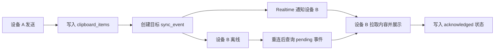
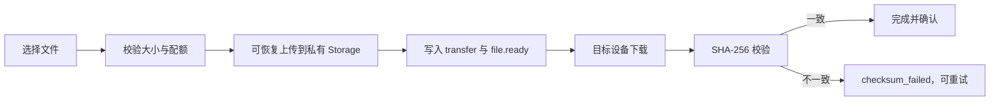

# FlowBridge 产品需求文档（PRD）V2.0

> 对应应用版本：v0.3.0（下一版本）  
> 当前基线：v0.2.0  
> 文档状态：Draft / 可进入设计与开发拆解  
> 更新日期：2026-07-31

---

## 0. 文档结论

FlowBridge v0.3.0 的目标不是继续堆功能，而是把已经验证成功的双机文本同步，升级为一个**清晰、可信、可长期使用和可运营管理的跨设备工作空间**。

本版本聚焦五件事：

1. 重构为接近 Apple 产品原则的简洁、规整、高可读界面；
2. 上线个人主页和跨设备同步的个性化设置；
3. 完成真实文件上传、下载、存储与配额管理；
4. 增加平台管理员后台，安全地管理用户、设备、存储和运行数据；
5. 补齐稳定性、隐私、审计、版本更新和真实验收体系。

“像苹果”在本文中指：清晰的信息层级、克制的颜色、稳定的网格、足够大的文字与点击区域、自然的动效和极低的学习成本；不复制 Apple 的具体界面或品牌资产。

---

# 一、现状复盘

## 1.1 已验证能力

- Windows Electron 客户端可安装和运行；
- Supabase 邮箱账号登录可用；
- 两台 Windows 使用同一账号后可以互相发现；
- Realtime 双向文本与 Prompt 传输成功；
- 离线事件补收、设备心跳、RLS 数据隔离已经具备基础实现；
- GitHub CI、公开 Release 和安装包发布链路可用。

## 1.2 当前体验问题

### 可读性

- 当前 CSS 约 90 处字号声明中，80 处不超过 11px；
- 导航、副标题、状态、时间和按钮文字普遍过小；
- 超宽屏使用时，用户需要靠近屏幕阅读，不符合桌面生产力工具定位；
- 正文、元信息和操作按钮之间的层级差不够清晰。

### 布局

- 左侧导航偏宽，主内容集中在页面顶部，纵向留下大量无意义空白；
- 搜索、筛选、标题、全局操作同时占据两层横向区域，信息密度失衡；
- 卡片高度、内边距、图标尺寸和文本基线缺少统一规则；
- 超宽屏没有内容最大宽度和分栏策略；
- Windows 原生 File/Edit/View/Window 菜单暴露，破坏产品完整感；
- 界面底部仍显示 v0.1，未与安装包版本同步。

### 产品完整性

- 缺少个人主页、头像、昵称、账号安全和存储概览；
- 自定义设置仅有基础开关，不能配置首页、侧栏、字号和默认设备；
- 文件页面仍未接入真实 Storage；
- 平台拥有者无法查看用户、处理异常账号、调整配额或追踪后台错误；
- 管理操作、敏感数据访问和用户状态变更没有审计链路。

---

# 二、产品目标与成功标准

## 2.1 产品目标

### G1：高可读、低认知负担

用户第一次打开应用即可理解“当前设备—目标设备—发送内容”的关系，不需要阅读说明书。

### G2：从文本桥接升级为个人工作空间

用户拥有可识别的个人主页、偏好设置、设备列表、存储空间和活动记录。

### G3：真实文件闭环

文件不再模拟进度；发送、断点续传、下载、校验、过期和删除均有真实后端状态。

### G4：可运营、可追责

管理员能够管理用户和资源，但默认不能随意查看用户正文；所有高权限操作必须被记录。

## 2.2 核心成功标准

| 维度 | 发布门槛 |
|---|---|
| 可读性 | 默认正文不小于 15px；辅助文字不小于 13px；徽标最小 12px |
| 操作尺寸 | 主要交互热区不小于 40×40px，关键按钮建议 44px 高 |
| 布局 | 1366×768、1920×1080、2560×1440 下无错位或不可达操作 |
| 文本同步 | 双机双向成功率 ≥99%，在线 P95 到达时间 ≤2 秒 |
| 文件同步 | 100MB 文件成功率 ≥95%，失败可重试，校验错误不得显示成功 |
| 离线恢复 | 接收端离线后重新上线，待收文本和文件可自动补收 |
| 权限 | 跨用户 RLS 越权自动化测试 0 失败 |
| 管理审计 | 用户禁用、角色、配额、设备撤销等管理动作 100% 写入审计日志 |
| 稳定性 | 8 小时运行无崩溃、无重复回传风暴、无持续内存增长 |

## 2.3 非目标

- 不在本版本实现 macOS 客户端完整适配；
- 不实现团队协作文档和多人实时编辑；
- 不实现计费、订阅和发票系统；
- 不实现端到端加密与管理员查看正文同时存在的矛盾方案；
- 不实现 AI 自动改写、摘要或内容训练；
- 不开放第三方插件市场。

---

# 三、用户与权限角色

| 角色 | 能力 |
|---|---|
| 普通用户 User | 管理本人资料、设备、偏好、文本、文件和存储 |
| 管理员 Admin | 查看用户与资源元数据、暂停账号、撤销设备、调整配额、查看审计 |
| 超级管理员 Super Admin | 管理管理员角色、全局配置和紧急安全操作 |

## 3.1 权限原则

- 普通用户只能访问自己的业务数据；
- Admin 默认只看元数据，不直接查看剪贴板正文、Prompt 正文或文件内容；
- 如确需“支持模式”查看内容，必须由 Super Admin 授权，填写原因，限定有效期，并写入审计；
- `service_role` / Secret key 永远不能进入桌面客户端；
- 管理动作通过受保护的 Edge Function 或服务端 RPC 执行；
- 用户不能通过修改 `profiles` 或客户端请求把自己提升为管理员。

---

# 四、信息架构

## 4.1 普通用户导航

1. 首页
2. 剪贴板
3. 文件传输
4. Prompt Library
5. 我的存储
6. 设备
7. 个人主页
8. 设置

## 4.2 管理员导航

仅对 Admin / Super Admin 显示：

1. 管理概览
2. 用户管理
3. 存储与配额
4. 设备与会话
5. 传输监控
6. 审计日志
7. 系统配置

## 4.3 桌面框架

- 默认侧栏宽 240px，可折叠为 72px 图标栏；
- 主内容区最大宽度 1280px，超宽屏居中并允许特定页面双栏；
- 顶栏只保留页面标题、搜索和最多 3 个高频全局操作；
- 账号入口统一进入个人主页，不同时出现多套头像入口；
- Windows 原生菜单默认隐藏，必要功能进入应用菜单或快捷键面板；
- 版本号从 `package.json` / Electron API 动态读取。

---

# 五、视觉与交互系统

## 5.1 设计原则

1. **先内容，后装饰**：减少发光、边框和同时出现的强调色；
2. **一屏一个主任务**：每页只有一个最突出的主按钮；
3. **稳定网格**：8px 基础间距，16/24/32px 为主要节奏；
4. **渐进呈现**：次要操作放入详情页或更多菜单；
5. **状态诚实**：等待、上传、已送达、已接收、失败必须来自真实后台状态；
6. **可恢复**：删除、撤销、失败和断线均提供清晰后路。

## 5.2 字体规范

推荐字体栈：

```css
font-family: "Segoe UI Variable", Inter, "PingFang SC", "Microsoft YaHei UI", sans-serif;
```

| 场景 | 字号/行高 | 字重 |
|---|---|---|
| 页面主标题 | 28/36px | 650–700 |
| 区块标题 | 20/28px | 600–650 |
| 卡片标题 | 16/24px | 600 |
| 正文 | 15/24px | 400–500 |
| 次要信息 | 13/20px | 400–500 |
| 徽标/极短标签 | 12/16px | 600 |

规则：

- 常规信息不得使用 12px 以下字号；
- 不使用 8px、9px、10px 作为产品正文；
- 支持 90%、100%、110%、125% 四档界面缩放，默认 100%；
- 字号变大时不得截断关键操作或出现水平滚动；
- 中文正文每行建议 30–50 个汉字，长 Prompt 提供展开阅读模式。

## 5.3 色彩与材质

- 默认同时提供浅色、深色和跟随系统；
- 浅色作为新版主展示主题，深色保持一致结构；
- 背景与卡片主要依靠明度差，不依赖密集描边；
- 主色只用于主操作、选中状态和进度；
- 成功、警告、失败颜色不得只靠颜色表达，必须配图标或文字；
- 毛玻璃仅用于顶栏、浮层或临时控件，不用于整页卡片堆叠。

## 5.4 动效

- 页面切换 160–220ms；
- 弹层和菜单 120–180ms；
- 禁止无意义持续呼吸和无限流动动画；
- 传输动画必须反映真实进度；
- 开启“减少动态效果”后取消位移和大面积透明变化。

---

# 六、页面需求

## 6.1 首页（P0）

### 页面目标

回答三个问题：当前是否连接、最近收到了什么、下一步最可能做什么。

### 页面结构

- 顶部：问候、当前账号、云端连接状态；
- 核心发送器：选择目标设备、输入文本、添加文件；
- 设备条：当前设备与最近目标设备；
- 最近活动：最多 5 条，可进入完整历史；
- 存储概览：已用空间、配额和即将过期文件；
- 可配置的小组件区域。

### 验收

- 1920×1080 首屏不滚动即可完成一次文本发送；
- 未连接、仅一台设备、目标离线、配额不足均有独立空状态；
- 首页不得出现没有真实来源的统计数字。

## 6.2 剪贴板（P0）

- 默认采用可读列表，不将完整 Prompt 塞进单行卡片；
- 支持全部、文本、Prompt、链接、收藏筛选；
- 卡片显示来源、目标、送达状态和创建时间；
- 点击卡片进入阅读抽屉，可复制、收藏、保存为 Prompt、删除；
- 搜索支持正文、设备名和时间范围；
- 列表默认摘要，正文至少 15px；
- 清空为危险操作，显示影响范围并支持短时撤销。

## 6.3 文件传输（P0）

- 接入 Supabase 私有 Storage；
- 小文件可标准上传，大于 6MB 使用可恢复上传；
- 状态：等待、上传、已上传、等待接收、下载、校验、完成、失败、取消、过期；
- 展示真实字节数、速率、剩余时间和失败原因；
- 支持断线恢复、手动重试、取消、重新下载；
- 接收后执行 SHA-256 校验，校验不一致不得标记完成；
- 默认单文件上限 500MB，单批最多 20 个；
- 可在管理员配置中降低用户上限，但不能超过平台硬上限。

## 6.4 我的存储（P0）

### 功能

- 查看总配额、已使用、可用空间；
- 按图片、视频、文档、压缩包、其他分类；
- 支持搜索、排序、多选、下载、删除、恢复；
- 显示来源设备、关联传输、大小、校验值、创建时间和过期时间；
- 回收站默认保留 30 天；
- 临时传输文件默认保留 7 天，可手动转为长期保存；
- 接近 80% 和 95% 配额时分别提示；
- 超额后允许下载和删除，不允许新上传。

### 默认配额

- 内测普通用户：2GB；
- 管理员可按用户调整；
- 配额变更必须记录操作者、旧值、新值和原因。

## 6.5 Prompt Library（P1）

- 卡片改为标题优先，正文摘要控制在 3–5 行；
- 支持标签、收藏、模型、来源设备、版本关系和全文搜索；
- 提供专注阅读/编辑页；
- 支持把收到的文本一键保存为 Prompt；
- 云端保存与本地草稿状态明确区分；
- 删除进入回收站，30 天后清理。

## 6.6 设备页面（P0）

- 展示设备名、平台、版本、在线状态、最后活动和存储路径；
- 当前设备明显标记且不能作为发送目标；
- 可设置默认目标设备；
- 支持重命名、撤销、重新连接；
- 撤销设备后，旧会话应在下一次 API 请求或 30 秒内失效；
- 客户端版本过旧时显示升级提示。

## 6.7 个人主页（P0）

### 基本资料

- 头像、昵称、邮箱、个人简介、地区/时区、加入时间；
- 头像支持裁剪、替换和恢复默认；
- 邮箱只读显示，修改邮箱进入独立安全流程；
- 支持修改密码、退出当前设备、退出所有设备。

### 个人概览

- 已连接设备数；
- 近 7/30 天发送与接收数量；
- 文件存储使用量；
- 最近登录设备；
- 常用目标设备；
- 账号状态和版本信息。

### 隐私

- 默认不展示文本或 Prompt 正文统计；
- 用户可以导出个人数据；
- 用户可以发起账号删除，进入 7 天冷静期。

## 6.8 自定义设置（P0）

### 外观

- 浅色、深色、跟随系统；
- 4–6 个受控强调色，不支持任意颜色导致对比度失控；
- 字号/界面缩放；
- 舒适和紧凑两种密度；
- 减少动态效果。

### 首页与导航

- 显示/隐藏首页组件；
- 拖拽调整组件顺序；
- 调整侧栏导航顺序；
- 固定最常用页面；
- 记住上次打开页面。

### 同步

- 默认目标设备；
- 接收后是否自动写入剪贴板；
- 自动同步仍默认关闭；
- 文件默认下载目录；
- Wi-Fi/计量网络上传规则；
- 历史与临时文件保留时间。

### 通知与隐私

- 文本、文件、设备、配额通知独立设置；
- 锁屏通知默认不显示正文；
- 管理登录会话和设备；
- 导出数据、清空历史、注销账号。

### 同步规则

- 用户偏好保存在云端，同时保留本机覆盖项；
- 主题、字号、首页布局可跨设备同步；
- 下载目录、窗口位置等设备相关设置不得跨设备覆盖。

## 6.9 管理后台（P0）

### 管理概览

- 总用户、近 7 天活跃用户、在线设备、存储总量；
- 传输成功率、失败率、积压事件、异常版本分布；
- 只展示汇总和元数据，不展示用户正文。

### 用户管理

- 按邮箱、昵称、用户 ID、状态搜索；
- 查看账号状态、角色、注册时间、最近登录、设备、配额和资源数量；
- 暂停/恢复账号；
- 撤销全部设备会话；
- 调整存储配额；
- 添加内部备注；
- 用户删除必须二次确认并进入延迟删除队列。

### 数据内容管理

- 可以查看用户拥有的剪贴板、Prompt、文件、传输数量和大小；
- 默认列表只显示类型、大小、哈希、时间、来源设备和状态；
- 默认不能预览剪贴板正文、Prompt 正文和文件内容；
- 内容访问仅允许“限时支持模式”，需填写工单/原因并记录审计；
- 支持定位失败传输、孤儿文件、过期资源和异常占用；
- 支持按规则清理过期资源，不允许无记录的直接删除。

### 审计日志

- 记录操作者、目标用户、动作、资源、原因、IP/设备摘要、结果和时间；
- 审计日志普通管理员不可删除；
- 支持按人、动作、时间和资源筛选；
- 敏感字段脱敏，不记录密码、Token 或 Secret key。

---

# 七、核心流程

## 7.1 双机文本流程



## 7.2 文件流程



## 7.3 管理动作流程

1. 校验管理员角色；
2. 输入动作原因；
3. 服务端再次授权；
4. 执行动作；
5. 写入不可由普通管理员删除的审计日志；
6. 将结果反馈到管理页；
7. 高风险动作通知目标用户。

---

# 八、后端与数据模型

## 8.1 沿用实体

- `devices`
- `clipboard_items`
- `transfers`
- `prompts`
- `projects`
- `sync_events`
- 私有 Storage bucket `flowbridge-files`

## 8.2 新增实体

### profiles

| 字段 | 说明 |
|---|---|
| id | 对应 auth.users.id |
| display_name | 昵称 |
| avatar_path | 私有/受控头像路径 |
| bio | 个人简介 |
| locale | 语言 |
| timezone | 时区 |
| account_status | active/suspended/deletion_pending |
| created_at/updated_at | 时间 |

### user_preferences

- `user_id`
- `theme`
- `accent`
- `font_scale`
- `density`
- `sidebar_order jsonb`
- `home_widgets jsonb`
- `default_target_device_id`
- `notification_policy jsonb`
- `retention_policy jsonb`
- `updated_at`

### user_roles

- `user_id`
- `role`：user/admin/super_admin
- `granted_by`
- `granted_at`
- 仅服务端可以修改。

### storage_items

- `id`
- `owner_id`
- `transfer_id`
- `storage_key`
- `original_name`
- `mime_type`
- `size_bytes`
- `sha256`
- `category`
- `retention_type`
- `expires_at`
- `deleted_at`
- `created_at`

### storage_quotas

- `user_id`
- `quota_bytes`
- `used_bytes_cached`
- `updated_by`
- `updated_at`

### audit_logs

- `id`
- `actor_id`
- `target_user_id`
- `action`
- `resource_type`
- `resource_id`
- `reason`
- `metadata_redacted jsonb`
- `result`
- `created_at`

## 8.3 现有表调整

### transfers 新增

- `bytes_transferred`
- `upload_session_id`
- `retry_count`
- `last_error_code`
- `received_at`
- `updated_at`

### devices 新增

- `device_fingerprint_hash`
- `last_ip_hash`
- `last_app_version`
- `revoked_by`
- `revoked_reason`

## 8.4 数据生命周期

- 临时传输文件：默认 7 天；
- 回收站：30 天；
- 已确认删除资源：异步删除 Storage 对象并记录结果；
- 审计日志：至少保留 180 天；
- 已注销账号：7 天冷静期后清除业务数据；
- 清理任务必须幂等，可重复执行且不会误删未过期资源。

---

# 九、安全、隐私与合规

## 9.1 必须实现

- 所有用户表启用 RLS；
- RLS 测试覆盖用户 A 无法读取或修改用户 B 数据；
- 管理 API 不接受客户端自报角色；
- 上传路径固定为用户 ID 前缀并校验对象所有权；
- 签名下载 URL 短时有效；
- 密码、会话 Token、Secret key 不写日志；
- 管理员内容访问必须可见、限时、有原因、有审计；
- 暂停账号后，刷新会话或服务端请求应拒绝继续写入；
- 高风险操作采用二次确认。

## 9.2 用户可见承诺

- 不把私人内容用于模型训练；
- 默认不自动发送剪贴板；
- 默认不在通知中显示完整正文；
- 明确显示文件保留时间和删除时间；
- 提供数据导出和账号删除入口；
- 隐私政策、服务条款和管理员访问规则在公开发布前上线。

---

# 十、性能与可靠性

- 首屏可交互时间：冷启动 P95 ≤3 秒；
- 页面切换反馈 ≤100ms，动画完成 ≤220ms；
- 10,000 条剪贴板记录使用虚拟列表，滚动无明显卡顿；
- 搜索输入后 300ms 内展示结果或加载状态；
- 在线文本到达 P95 ≤2 秒；
- 断线重连采用指数退避，不高频请求；
- 同一事件基于 ID 幂等处理；
- 100MB 文件断线后可从已上传部分继续；
- 配额、Storage 对象和数据库记录每日进行一致性巡检；
- 错误信息包含用户可理解描述和可追踪错误码。

---

# 十一、埋点与运营指标

## 11.1 产品指标

- 激活：注册后 24 小时内成功连接两台设备；
- 核心使用：每周至少完成一次跨设备发送；
- 留存：7 日、30 日仍有成功传输；
- 文本成功率和 P95 延迟；
- 文件成功率、重试率、校验失败率；
- 用户存储占用和临近配额比例；
- 用户自定义设置使用率。

## 11.2 隐私规则

- 只采集事件类型、耗时、大小、状态、版本和匿名技术标识；
- 不采集剪贴板正文、Prompt 正文、文件名或文件内容；
- 管理看板中的用户内容统计只显示数量和容量。

---

# 十二、优先级

## P0：本版必须完成

- 新设计系统、字号和桌面框架重构；
- 首页、剪贴板、设备页改版；
- 个人主页；
- 外观、字号、首页和导航自定义；
- 真实文件上传、下载、校验和失败恢复；
- 我的存储、配额和回收站；
- 用户、角色、存储、设备和审计管理后台；
- RLS、管理员服务端授权和审计；
- 版本号动态显示；
- Windows 安装包回归。

## P1：本版尽量完成

- Prompt Library 云端化和专注编辑页；
- 托盘快速发送；
- 全局搜索/命令面板；
- 下载目录和网络策略；
- 用户数据导出；
- 版本更新提醒；
- 系统健康页。

## P2：后续候选

- 局域网直连/WebRTC；
- 团队空间和成员协作；
- AI 自动分类与每日工作摘要；
- 第三方 AI 工具集成；
- macOS 客户端；
- 端到端加密工作空间；
- 商业订阅与计费。

---

# 十三、开发里程碑

## M0：设计与基础设施

- 完成设计 Token、字体、间距、响应式网格和组件清单；
- 确认新数据模型、角色和迁移方案；
- 为 v0.2 数据准备可回滚迁移。

## M1：界面重构

- 完成桌面框架、首页、剪贴板、设备和设置；
- 完成浅色/深色、字号和密度；
- 通过三档分辨率与 Windows 125%/150% 缩放测试。

## M2：个人与偏好

- 完成 profile、preferences、头像和安全页面；
- 完成跨设备偏好同步和设备级覆盖。

## M3：真实文件与存储

- 完成可恢复上传、下载、校验、配额、过期和回收站；
- 完成断网、重启、重复文件和超额测试。

## M4：管理后台

- 完成用户、设备、配额、传输和审计页面；
- 完成服务端管理员鉴权与越权测试。

## M5：硬化与发布

- 完成性能、稳定性、安全和双机验收；
- 补齐隐私政策、服务条款、代码签名决策和升级提示；
- 发布 v0.3.0 安装包与迁移说明。

---

# 十四、发布验收清单

## 14.1 视觉验收

- [ ] 常规文字均不小于 13px，正文默认 15px；
- [ ] 关键按钮热区满足 40×40px；
- [ ] 1366×768 下主操作可见；
- [ ] 2560×1440 下内容不过度拉伸；
- [ ] Windows 125%/150% 缩放无截断；
- [ ] 浅色、深色、减少动态效果均通过；
- [ ] 原生菜单和旧版本号问题已修复；
- [ ] 空、加载、断线、错误、无权限状态齐全。

## 14.2 功能验收

- [ ] 两台 Windows 文本双向发送成功；
- [ ] 目标离线后文本可补收；
- [ ] 1MB 文本边界正确；
- [ ] 小文件和 100MB 文件真实传输成功；
- [ ] 中断后可恢复，不从零开始；
- [ ] SHA-256 不一致时明确失败；
- [ ] 超配额时阻止上传但允许删除；
- [ ] 用户偏好跨设备同步；
- [ ] 管理员可以管理用户但默认看不到正文；
- [ ] 管理操作全部进入审计日志。

## 14.3 安全验收

- [ ] 用户 A 无法读写用户 B 数据；
- [ ] 普通用户无法调用管理员接口；
- [ ] 客户端包中不存在 Secret/service_role key；
- [ ] 撤销设备后访问及时失效；
- [ ] 敏感内容不进入日志或通知预览；
- [ ] 删除和配额变更有审计、确认和恢复策略。

---

# 十五、产品负责人建议

1. **下一版先把“真实文件 + 清晰界面”做扎实。** 这两项最能把 FlowBridge 从演示工具变成日常工具。
2. **管理后台不要等用户变多再补。** 账号异常、配额、孤儿文件和误删除一旦出现，没有后台会非常被动。
3. **不要让管理员默认阅读用户内容。** 可运营不等于无边界访问；元数据管理和限时支持模式更可信。
4. **保留手动发送为默认。** 自动剪贴板同步容易泄露密码、验证码和公司内容，应继续明确授权。
5. **把可读性作为发布门槛。** 不再允许用 8–11px 字体换取“看起来信息很多”。
6. **新增功能必须有真实状态。** 未接后端的按钮应标注“即将推出”或禁用，不能模拟成功。
7. **先服务个人跨设备，再进入团队。** 团队空间、共享权限和计费会显著提高复杂度，建议放到后续版本。

---

# 十六、一句话版本定义

**FlowBridge v0.3.0：一个更清晰、更像成熟桌面产品的个人跨设备工作空间，能够真实传输文本与文件、管理个人资料和存储，并由安全可审计的后台进行运营。**
