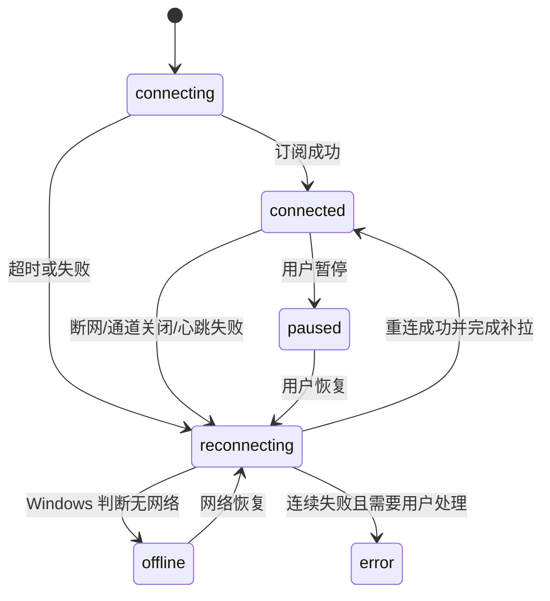
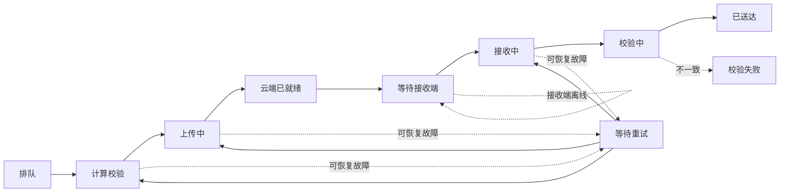

# FlowBridge 产品需求文档（PRD）V3.0

> 目标版本：v0.4.0「稳定连接」  
> 文档日期：2026-08-04  
> 适用平台：Windows 10 / Windows 11  
> 版本主题：可靠传输、自动恢复、程序内更新、个性化与零无效按钮

---

## 0. 文档结论

这一版不再以“增加更多页面”为首要目标，而是把 FlowBridge 从“偶尔能传”升级成“普通用户可以长期稳定使用”。

本版必须解决五件事：

1. **文件必须双向可达。** 电脑 A 能发给电脑 B，电脑 B 也必须能发给电脑 A；接收端错过实时通知后仍能自动补收。
2. **短暂断网不能让任务丢失。** 网络恢复、电脑唤醒或软件重启后，未完成任务自动继续，不要求用户从头再来。
3. **以后在程序里更新。** 用户不再每次手动下载并重新安装；当前 v0.3.3 只需最后手动升级一次到 v0.4.0，之后在程序内完成更新。
4. **头像与壁纸真正可自定义。** 用户可以上传、预览、替换和恢复默认，且两台电脑保持一致。
5. **无效按钮清零。** 页面上出现的按钮必须有真实结果；暂未实现的入口直接移除，不以“假成功”或只改界面状态代替真实功能。

> [!important] 关于“文件传输不会失败”
> 任何联网软件都无法保证永远不出现断网、磁盘不足或云端故障。本 PRD 将目标定义为：**可恢复的故障自动恢复，不丢任务、不损坏文件；无法恢复的故障明确告诉用户原因和下一步操作。** 对用户来说，短暂断线不应变成一次永久失败。

---

## 1. 背景与当前问题

### 1.1 用户反馈

- 一台电脑可以发送，另一台电脑有时无法接收；
- 连接经常“断触”，需要重启或等待后才能继续使用；
- 文件传输失败后点击重试，实际没有重新传输；
- 每次升级都要重新下载安装包，操作复杂；
- 希望头像、壁纸可以上传自己的图片；
- 软件中仍存在点击后没有效果、只改变样式或没有完整结果的按钮。

### 1.2 代码现状核查

| 问题 | 当前实现 | 用户影响 |
|---|---|---|
| 实时连接断开 | 启动时订阅一次，未完整监听连接状态，也没有统一重连调度器 | 断网、睡眠或网络切换后可能不再收到事件 |
| 漏接事件 | 主要在软件启动时查询一次待接收事件 | 在线期间错过通知后，可能一直看不到文件 |
| 接收依赖实时通知 | `file.ready` 到达时才更新接收端列表 | Realtime 短暂断线就可能出现“发送端成功、接收端没有” |
| 重试按钮 | 只把本地状态改回 `queued` | 没有重新上传、下载或恢复分片 |
| 清理记录 | 只清理当前本地列表 | 下次从云端加载时记录可能重新出现 |
| 后台接收 | 关闭窗口后程序直接退出 | 软件不在前台时无法保持接收 |
| 自动更新 | 没有更新依赖、检查逻辑或更新界面 | 每次必须手动下载安装包 |
| 头像 | 数据库已有 `avatar_path`，界面仍显示姓名缩写 | 无法真正上传头像 |
| 壁纸 | 当前没有数据字段、上传或渲染功能 | 无法自定义背景 |
| 无效控件 | 工作空间按钮、铃铛、`Ctrl K` 提示等没有完整动作 | 用户不知道按钮是否损坏 |

### 1.3 本版原则

- **可靠性优先于新功能数量。**
- **数据库记录不是送达证明。** 只有接收端下载完成并校验通过，发送端才显示“已送达”。
- **实时通知不是唯一通道。** Realtime 用于加速，定时补拉用于兜底。
- **状态必须真实。** 页面显示的进度、在线状态、失败原因和版本状态必须来自真实系统状态。
- **小白可处理。** 错误提示必须说人话，并给出可点击的解决动作。

---

## 2. 产品目标与非目标

### 2.1 产品目标

#### G1：双向可靠送达

- 同一账号的任意两台 Windows 设备均能互为发送端和接收端；
- 目标设备离线时任务进入待接收队列，上线后自动发现；
- 接收端校验通过后，发送端收到明确确认；
- 同一个任务重复通知不会重复下载或生成重复文件。

#### G2：连接自动恢复

- 断网、Wi-Fi 切换、电脑睡眠、程序重启后自动重连；
- 重连后补拉断线期间的文本、文件任务和状态变化；
- 用户可以看到“连接中、已连接、正在重连、离线、已暂停、异常”六种真实状态。

#### G3：程序内更新

- 自动检查 GitHub 正式 Release；
- 在程序中显示下载进度和更新说明；
- 更新下载完成后，用户点击“重启并安装”即可完成；
- 有传输任务时不得强制重启，更新延后到任务结束。

#### G4：个性化

- 支持自定义头像和工作空间壁纸；
- 支持预览、替换、删除和恢复默认；
- 新设备登录后能显示同一账号的头像和壁纸。

#### G5：零无效按钮

- 每个可点击控件都必须有真实动作、加载状态、成功结果和失败结果；
- 尚未完成的功能不显示可点击按钮；
- 不允许只改本地界面、不改变真实数据的“假操作”。

### 2.2 成功标准

| 指标 | v0.4.0 发布标准 |
|---|---|
| 稳定网络下双向文件最终送达率 | 100 次真实双机传输，100% 完整送达 |
| 人为断网后的自动恢复率 | 20 次中断测试，网络恢复后 20 次全部自动继续 |
| 漏接补拉时间 | 恢复连接后 60 秒内发现待接收任务 |
| 文件完整性 | 所有完成任务 SHA-256 一致，损坏文件不得标记完成 |
| 重复文件 | 同一任务重复通知不得生成第二份传输记录 |
| 更新体验 | v0.4.0 到测试版 v0.4.1 全程不打开浏览器、不手动运行安装包 |
| 无效按钮 | 全页面按钮审计结果为 0 个无动作按钮 |
| 崩溃与数据丢失 | 测试期间无未恢复任务丢失，无已完成文件被覆盖损坏 |

### 2.3 非目标

本版暂不包含：

- macOS、手机和 Linux 客户端；
- 团队空间与跨账号分享；
- 局域网点对点传输；
- 无限文件大小；
- AI 自动分类、AI 总结和第三方 AI 工具接入；
- 复杂壁纸市场、动态壁纸或视频壁纸。

---

## 3. 核心使用场景

### 场景 A：两台电脑都在线

1. 用户在电脑 A 选择电脑 B；
2. 选择文件并点击发送；
3. FlowBridge 计算校验值并上传；
4. 电脑 B 自动发现任务并开始接收；
5. 下载完成后校验 SHA-256；
6. 电脑 B 显示“已接收”，电脑 A 显示“已送达”。

### 场景 B：接收电脑暂时离线

1. 电脑 A 上传文件；
2. 系统显示“已上传，等待电脑 B 上线”；
3. 电脑 B 上线或从睡眠恢复；
4. 不依赖旧通知，主动查询未完成任务；
5. 自动接收并向电脑 A 返回确认。

### 场景 C：传到一半断网

1. 文件上传或下载到 45%；
2. 网络断开，任务进入“等待网络”；
3. 页面保留已完成进度，不显示永久失败；
4. 网络恢复后自动从可恢复位置继续；
5. 校验成功后再标记完成。

### 场景 D：程序关闭后继续接收

1. 用户点击窗口关闭按钮；
2. FlowBridge 默认缩小到 Windows 系统托盘；
3. 后台继续维持连接与接收队列；
4. 收到文件后发出 Windows 通知；
5. 用户可从托盘菜单选择“打开 FlowBridge”或“彻底退出”。

### 场景 E：程序内升级

1. FlowBridge 检查到新版本；
2. 设置页和通知中心显示版本说明；
3. 后台下载更新；
4. 传输结束后用户点击“重启并安装”；
5. 软件自动重启，账号、设置、历史和待处理任务仍然存在。

---

## 4. P0 功能需求

## 4.1 连接管理器

### 目标

把 Supabase Realtime 从“一次性订阅”改为可观察、可重连、可补偿的长期连接。

### 连接状态

### 功能要求

1. 监听 Realtime 订阅状态，不得在尚未订阅成功时显示“云端已连接”；
2. 断线后按照 1、2、5、10、30 秒间隔自动重试，最长间隔不超过 30 秒；
3. Windows 网络恢复、电脑唤醒、账号重新登录时立即触发重连，不等待下一轮计时；
4. 每次重连成功后必须执行一次完整补拉；
5. 正常连接期间每 30 秒查询一次当前设备的未确认事件和待接收传输，作为 Realtime 的兜底；
6. 补拉使用事件 ID 与任务 ID 去重，同一事件只能生效一次；
7. 连续三次心跳失败时状态变为“正在重连”，而不是继续显示绿色在线；
8. 顶部连接状态可以点击，展开连接详情与“立即重连”；
9. 用户暂停同步时保留队列，不删除待处理任务；恢复后自动补拉；
10. 设备在线状态应同时参考最近心跳、Realtime 通道状态和当前客户端会话。

### 验收标准

- 关闭路由器 60 秒再恢复，两台电脑无需重启软件即可恢复连接；
- 电脑睡眠 10 分钟后唤醒，60 秒内重新显示真实设备状态；
- 断线期间发送的文件在接收端恢复后 60 秒内出现；
- 重复收到同一 `file.ready` 事件时只产生一个任务；
- Realtime 断开时界面不得继续显示“已连接”。

## 4.2 持久化传输队列

### 目标

传输任务不只存在于 React 页面内。关闭窗口、程序崩溃或电脑重启后，未完成任务仍能恢复。

### 任务状态

### 功能要求

1. 上传、下载和分片进度写入本机持久化队列；
2. 传输核心移动到 Electron 主进程执行，关闭页面或界面刷新不应中止任务；
3. 记录文件路径、已完成分片、上传会话、重试次数、最后错误和下次重试时间；
4. 上传中断时优先恢复原上传会话，不重复上传成功分片；
5. 下载中断时保留 `.part` 临时文件和已完成分片，恢复后继续；
6. 下载签名地址过期时自动申请新地址；
7. 每个失败分片最多自动重试 5 次，等待间隔逐步增加；
8. 同时最多上传 2 个、下载 2 个文件，避免网络与磁盘竞争导致假死；
9. 接收前检查保存目录权限和剩余磁盘空间；
10. 下载完成后先校验，再使用原子重命名生成最终文件；
11. 同名文件不得静默覆盖，自动生成 `文件名 (1).扩展名`；
12. 发送端只有收到接收端的校验成功确认后才显示“已送达”；
13. 接收确认丢失时，发送端主动查询任务状态，不要求接收端重复下载；
14. 任务过期前 24 小时提示用户；过期后提供“重新选择并发送”；
15. 所有中文、空格、括号和常见 Unicode 文件名仅作为显示名，云端对象键继续使用安全 ASCII。

### 真正的重试

- 上传任务仍能访问原文件：点击重试后从已有进度继续；
- 原文件被移动或删除：提示“找不到原文件”，并打开重新选择窗口；
- 下载任务失败：重新生成下载地址，从临时文件已有进度继续；
- 校验失败：删除损坏的最终结果，只重新下载失败分片或重新接收；
- 用户点击重试后必须出现真实网络请求和进度变化，不能只改变状态文字。

## 4.3 自动接收与收件箱

### 默认规则

- 用户第一次进入文件页时选择下载目录；
- 设置好下载目录后，默认开启“自动接收来自我自己设备的文件”；
- 未设置目录时，任务进入收件箱并显示“选择保存位置”；
- 只有同一账号下、未撤销的设备可以触发自动接收；
- 自动接收不自动打开文件，降低安全风险。

### 收件箱

- 分为“等待接收、正在接收、已完成、需要处理”；
- 显示来源设备、目标设备、文件大小、时间和过期时间；
- 可批量接收、暂停、继续和清理已完成；
- 接收成功后向发送端回传确认；
- 目标设备版本不兼容时显示升级提示，而不是无响应。

### 验收标准

- 接收电脑不打开文件页，也能发现并自动接收；
- 应用最小化到托盘时仍能接收；
- 接收电脑离线 30 分钟后上线，任务自动进入队列；
- 同一账号两台设备互换发送方向，结果完全一致。

## 4.4 后台运行与 Windows 托盘

1. 默认“关闭窗口时继续后台运行”；
2. 关闭窗口后显示一次说明：“FlowBridge 正在后台接收，可从托盘彻底退出”；
3. 托盘菜单提供：打开、暂停/恢复同步、查看进行中任务、检查更新、退出；
4. 真正退出前，如果存在进行中任务，提示用户选择“等待完成”或“退出并保留任务”；
5. 设置页允许关闭后台运行，但要说明关闭后无法实时接收；
6. Windows 开机启动作为可选项，默认关闭。

## 4.5 程序内自动更新

### 技术方案

首选使用 Electron 自动更新能力配合官方 GitHub Releases，不新增独立更新服务器。发布流程继续使用公开仓库：

`cccui070321-pixel/FlowBridge`

### 重要升级说明

当前 v0.3.3 没有自动更新代码，因此用户需要**最后一次手动安装 v0.4.0**。从 v0.4.0 开始，后续版本均可在程序内部更新。

### 功能要求

1. 启动后 30 秒检查一次更新，之后每 6 小时检查；
2. 设置页提供“检查更新”；
3. 显示当前版本、最新版本、发布日期和简短更新说明；
4. 正式版默认自动下载更新，下载时不阻塞正常使用；
5. 显示下载百分比、速度和剩余时间；
6. 下载完成后提供“重启并安装”和“稍后”；
7. 有上传或下载任务时禁止立即安装，并解释原因；
8. 更新安装后保留登录、设置、壁纸、头像、传输队列和历史；
9. 只接受官方 GitHub Release 的稳定通道更新；
10. 校验发布元数据和安装包 SHA-512，不执行校验失败的更新；
11. 检查失败不得影响文件传输，显示“稍后自动重试”；
12. 新版本启动失败时保留清晰的恢复说明和旧版本下载入口。

### 更新状态

- 已是最新版；
- 正在检查；
- 发现新版本；
- 正在下载；
- 等待传输完成；
- 可以安装；
- 安装失败；
- 当前版本过旧，需要升级后继续同步。

### 验收标准

- 使用测试 Release 完成 v0.4.0 → v0.4.1 的程序内升级；
- 测试过程不打开浏览器、不手动下载、不手动运行安装包；
- 更新下载到一半断网，恢复后能够继续或重新下载；
- 有进行中任务时不能被更新强制中断；
- 更新后账号和未完成传输仍然存在。

## 4.6 版本与协议兼容

1. 设备表记录客户端版本和传输协议版本；
2. 设备页显示每台电脑的 FlowBridge 版本；
3. 两台设备版本兼容时正常传输；
4. 版本过旧但仍兼容时显示温和更新提示；
5. 协议不兼容时禁止开始传输，并直接提供“更新此电脑”；
6. 不得出现发送端显示成功、接收端因版本不兼容而静默失败。

## 4.7 头像上传

### 功能

- 支持 JPG、PNG、WebP；
- 原图最大 5MB；
- 上传前提供 1:1 裁剪、缩放和预览；
- 保存后在侧边栏、个人主页和管理后台显示；
- 支持重新上传和恢复默认姓名缩写头像；
- 新头像保存成功后再删除旧头像，避免失败时头像丢失；
- 多台设备登录同一账号后自动同步。

### 安全与存储

- 文件实际类型必须是图片，不能只依赖扩展名；
- 图片转码为安全格式并移除不需要的元数据；
- 使用私有 Storage 路径 `用户ID/profile/avatar/`；
- 只有本人可修改，管理员默认只能看到头像结果，不能替用户上传。

## 4.8 自定义壁纸

### 功能

- 支持 JPG、PNG、WebP；
- 原图最大 15MB；
- 推荐尺寸不低于 1920×1080；
- 上传前显示桌面布局预览；
- 支持调整显示位置和背景遮罩强度；
- 支持替换、删除和恢复默认背景；
- 壁纸作为账号偏好同步到两台设备；
- 离线时使用本地缓存，不出现空白背景。

### 可读性要求

- 无论壁纸明暗，正文和按钮必须保持可读；
- 系统自动叠加半透明背景层，用户不能把遮罩调到导致文字不可读；
- 登录页、管理后台和危险确认弹窗不使用自定义壁纸，避免干扰信息判断。

## 4.9 无效按钮清零

### 当前已确认的控件处理

| 控件 | v0.4.0 处理方式 |
|---|---|
| 左上角工作空间下拉 | 当前只有一个空间，改为不可点击的信息卡；有多空间功能后再恢复下拉 |
| 右上角铃铛 | 实现真实通知中心，展示传输、连接、更新和错误通知 |
| 搜索框 `Ctrl K` | 实现快捷键并自动聚焦当前页面搜索；否则移除快捷键提示 |
| 文件“重试” | 调用真正的恢复上传/下载流程；找不到原文件时要求重新选择 |
| “清理已完成” | 只清理已完成/取消/过期记录，并同步真实数据；不得清空进行中任务 |
| 暂停同步 | 真正暂停新同步并保留队列；恢复时补拉遗漏任务 |

### 全局按钮验收规则

每个按钮必须至少满足以下一类：

1. 点击后产生真实导航、数据操作、系统操作或对话框；
2. 操作期间显示加载状态并防止重复点击；
3. 成功后能从真实数据确认结果；
4. 失败后显示原因和可执行下一步；
5. 当前条件不允许时禁用，并在旁边说明原因。

禁止：

- 没有 `onClick` 的按钮；
- 只改颜色或文字、没有真实请求的“重试”；
- 显示“成功”但数据库或文件系统没有变化；
- 尚未开发却表现为已经可用的入口；
- 用长期灰色按钮代替明确说明。

## 4.10 连接诊断中心

为了让技术小白也能判断问题，新增“连接诊断”页面：

- 当前网络是否可用；
- Supabase 是否可访问；
- 账号会话是否有效；
- Realtime 是否已订阅；
- 当前设备 ID、版本和协议版本；
- 最近一次心跳、重连和补拉时间；
- 待上传、待接收、失败任务数量；
- 下载目录是否可写、剩余空间是否足够；
- “立即重连”“重新登录”“打开下载目录”“复制诊断信息”操作。

诊断信息不得包含：密码、Token、签名下载地址、剪贴板正文和文件内容。

---

## 5. 通知中心

### 通知类型

- 文件等待接收；
- 文件已接收；
- 文件需要用户处理；
- 连接已断开/已恢复；
- 目标设备上线/离线；
- 新版本可用；
- 更新已下载；
- 存储空间不足；
- 账号或权限异常。

### 规则

- 铃铛角标显示未读数量；
- 点击通知跳转到对应任务或设置；
- 支持全部标为已读；
- 不在通知预览中显示敏感正文，遵循用户隐私设置；
- 同一错误短时间内合并，避免连续弹窗刷屏。

---

## 6. 页面调整

### 6.1 首页

- 增加真实连接状态卡；
- 显示进行中、等待网络、需要处理的传输数量；
- 显示两台设备版本是否一致；
- 有异常时提供一个明确主操作，例如“恢复连接”或“更新另一台电脑”。

### 6.2 文件传输页

- 分为“发送”和“收件箱”；
- 状态文字使用：排队、计算校验、上传、等待设备、接收、校验、已送达、等待网络、需要处理；
- 进度显示文件进度和当前阶段；
- 失败卡片不直接只显示 SDK 英文错误；
- 提供暂停、继续、取消、真正重试、重新选择原文件、打开所在文件夹；
- 支持筛选进行中、已完成和需要处理。

### 6.3 设备页

- 显示设备名称、在线状态、最后心跳、客户端版本、协议版本；
- 显示是否允许后台接收；
- 版本不一致时提供更新提示；
- 重复设备和已撤销设备可安全清理。

### 6.4 个人主页

- 点击头像进入上传与裁剪；
- 增加壁纸预览入口；
- 修改成功后全局立即更新；
- 上传失败时保留旧头像和旧壁纸。

### 6.5 设置页

新增分组：

- **连接与接收：** 自动接收、下载目录、后台运行、开机启动；
- **个性化：** 头像、壁纸、遮罩强度、恢复默认；
- **软件更新：** 自动检查、当前版本、检查更新、更新说明；
- **诊断：** 连接检查、复制诊断信息、日志目录；
- **关于：** GitHub、隐私说明、版本与协议版本。

---

## 7. 数据与后端调整

### 7.1 devices 增加

| 字段 | 用途 |
|---|---|
| client_version | 当前安装版本，例如 0.4.0 |
| protocol_version | 传输协议版本 |
| capabilities | 是否支持分片、自动接收、后台任务等 |
| last_realtime_at | 最近实时连接时间 |
| last_reconcile_at | 最近补拉时间 |

### 7.2 transfers 增加或规范

| 字段 | 用途 |
|---|---|
| current_stage | hashing/uploading/waiting/downloading/verifying |
| attempt_count | 已尝试次数 |
| next_retry_at | 下次自动重试时间 |
| sender_ready_at | 发送端上传完成时间 |
| receiver_started_at | 接收端开始时间 |
| receiver_ack_at | 接收校验成功时间 |
| protocol_version | 创建任务时的协议版本 |
| failure_category | network/auth/storage/disk/incompatible/user_action |
| last_error_code | 稳定错误码，不直接保存整段 SDK 文本 |

### 7.3 transfer_events

新增只追加的任务事件表，用于恢复和诊断：

- queued；
- upload_started；
- chunk_uploaded；
- sender_ready；
- receiver_discovered；
- download_started；
- verified；
- acknowledged；
- retry_scheduled；
- failed；
- cancelled。

同一任务和事件类型使用幂等键，防止重复写入。

### 7.4 user_preferences 增加

- wallpaper_path；
- wallpaper_overlay；
- auto_receive_files；
- background_run；
- launch_at_startup；
- auto_update；
- download_directory 只保存在本机，不上传完整本地路径。

### 7.5 Storage 规则

- 文件传输继续使用私有 `flowbridge-files`；
- 头像、壁纸使用清晰的用户目录前缀；
- Storage key 始终为安全 ASCII；
- 原始显示名保存在数据库；
- 替换头像或壁纸后清理旧对象；
- 定时清理过期任务和孤儿分片；
- RLS 保证普通用户只能访问自己的对象。

---

## 8. 客户端架构调整

### 8.1 Electron 主进程

负责：

- 文件选择和真实本地路径；
- SHA-256 计算；
- 上传、下载、分片与恢复；
- 持久化任务队列；
- 后台运行与系统托盘；
- 网络、睡眠和唤醒事件；
- 自动更新；
- 下载目录与磁盘空间检查。

### 8.2 React 页面

只负责：

- 展示真实任务状态；
- 接收主进程推送的进度；
- 用户操作与确认；
- 头像、壁纸、通知和诊断界面。

页面刷新或重建不应终止传输任务。

### 8.3 Supabase

负责：

- 登录与会话；
- 设备、传输、事件和确认记录；
- Realtime 快速通知；
- 定时补拉的数据来源；
- 私有文件、头像和壁纸存储；
- RLS 与管理员审计。

---

## 9. 错误信息规范

| 错误码 | 用户提示 | 主操作 |
|---|---|---|
| NETWORK_OFFLINE | 当前没有网络，恢复后会自动继续 | 查看连接状态 |
| REALTIME_RECONNECTING | 与云端暂时断开，正在重新连接 | 立即重连 |
| SESSION_EXPIRED | 登录状态已过期 | 重新登录 |
| SOURCE_FILE_MISSING | 找不到原文件，可能已被移动或删除 | 重新选择文件 |
| TARGET_OFFLINE | 目标电脑当前离线，上线后自动接收 | 知道了 |
| VERSION_INCOMPATIBLE | 两台电脑版本不兼容 | 更新此电脑 |
| STORAGE_QUOTA_EXCEEDED | 云端空间不足 | 清理存储 |
| STORAGE_URL_EXPIRED | 下载地址已过期，正在自动刷新 | 无需操作 |
| DOWNLOAD_FOLDER_DENIED | 无法写入当前下载目录 | 更换目录 |
| DISK_SPACE_LOW | 本机剩余空间不足 | 打开存储设置 |
| CHECKSUM_MISMATCH | 文件校验未通过，未生成最终文件 | 重新接收 |
| UPDATE_VERIFY_FAILED | 更新文件校验失败，已停止安装 | 重新检查更新 |

错误卡片需显示：发生阶段、简单原因、是否会自动恢复、下一步按钮、可复制的错误编号。

---

## 10. 测试与发布硬门槛

## 10.1 真实双机测试矩阵

必须在两台真实 Windows 电脑上双向执行：

| 类型 | 示例 |
|---|---|
| 文件大小 | 1KB、1MB、44MB、46MB、100MB、500MB |
| 文件类型 | JPG、PNG、DOCX、PDF、MP4、ZIP、EXE |
| 文件名 | 中文、英文、空格、括号、长文件名、Emoji |
| 网络 | 稳定、上传中断网、下载中断网、Wi-Fi 切换 |
| 设备状态 | 在线、离线后上线、睡眠后唤醒、程序重启 |
| 方向 | A→B、B→A |
| 异常 | 磁盘不足、目录无权限、签名地址过期、版本不兼容 |

## 10.2 必须通过的用例

- [ ] A→B 连续发送 50 个文件，全部校验成功；
- [ ] B→A 连续发送 50 个文件，全部校验成功；
- [ ] 20 次在不同进度断网，恢复后任务全部自动继续；
- [ ] 接收端离线期间创建任务，上线后 60 秒内全部出现；
- [ ] 睡眠和唤醒后无需重启软件；
- [ ] 关闭窗口到托盘后仍能接收；
- [ ] 重启程序后未完成队列仍存在；
- [ ] 重复通知不生成重复任务；
- [ ] 校验失败不生成错误的最终文件；
- [ ] 发送端只有收到接收确认后才显示“已送达”；
- [ ] v0.4.0 可以在程序内升级到测试版 v0.4.1；
- [ ] 更新时进行中的传输不会被中断；
- [ ] 头像、壁纸在两台设备同步并支持恢复默认；
- [ ] 所有页面完成按钮清单，0 个无动作按钮；
- [ ] 普通用户不能读取或修改其他用户的文件、头像、壁纸和任务。

## 10.3 自动化测试

- 连接状态机单元测试；
- 重连退避与补拉测试；
- 事件幂等与重复通知测试；
- 上传/下载恢复测试；
- 分片清单与 SHA-256 测试；
- 文件名安全化测试；
- 更新状态机测试；
- 全页面按钮行为测试；
- 数据迁移与 RLS 测试。

## 10.4 发布禁止项

出现以下任一情况不得发布：

- 只在一台电脑自测；
- 发送端显示完成但接收端没有文件；
- 重试按钮仍然只改本地状态；
- Realtime 断开后必须重启软件；
- 自动更新没有完成真实版本升级；
- 存在点击无动作的按钮；
- 更新后丢失登录、设置或任务；
- 校验失败仍产生最终文件；
- 将管理员密钥、Token 或签名 URL 写入日志。

---

## 11. 版本计划

### M0：可靠性基础

- 数据库迁移；
- 设备版本与协议能力；
- 传输事件与稳定错误码；
- 本地持久化队列。

### M1：连接恢复

- 连接状态机；
- 自动重连；
- 30 秒补拉；
- Windows 网络与唤醒恢复；
- 连接诊断。

### M2：双向可靠传输

- 主进程传输引擎；
- 上传/下载恢复；
- 自动接收与收件箱；
- 托盘后台运行；
- 真正的重试、取消和清理。

### M3：程序内更新

- GitHub Release 更新源；
- 检查、下载、校验、安装状态；
- 活跃任务保护；
- v0.4.0 → v0.4.1 升级验收。

### M4：个性化与界面清理

- 头像上传和裁剪；
- 壁纸上传、预览与遮罩；
- 通知中心；
- 全量无效按钮审计与修复。

### M5：真实双机验收与发布

- 测试矩阵；
- 权限测试；
- 安装与升级回归；
- 预发布测试；
- 发布 v0.4.0。

---

## 12. 优先级

### P0：v0.4.0 必须完成

- 自动重连与漏事件补拉；
- 持久化传输队列；
- 双向自动接收；
- 真正断点恢复、重试和接收确认；
- 系统托盘后台接收；
- 程序内自动更新；
- 版本兼容检查；
- 头像与壁纸上传；
- 通知中心；
- 连接诊断；
- 无效按钮清零；
- 真实双机发布门槛。

### P1：建议尽快完成

- Windows 开机启动；
- 一键导出脱敏诊断包；
- 失败任务和孤儿分片后台巡检；
- 安装包代码签名，减少 SmartScreen 警告；
- 新用户“两台电脑如何连接”的图形引导；
- 下载目录按设备保存。

### P2：后续版本

- 同一局域网优先直连，云端失败时回退；
- 端到端加密工作空间；
- 团队共享；
- macOS 客户端；
- AI 自动分类和工作摘要。

---

## 13. 推荐产品决定

以下是结合当前故障后给出的默认建议：

1. **可靠性压过新功能。** v0.4.0 不再加入团队协作、AI 分类等大功能，先让双机传输稳定。
2. **自动接收默认开启，但必须先选下载目录。** 这样小白不需要每次点“接收”，同时不会把文件保存到未知位置。
3. **关闭窗口默认缩到托盘。** 否则接收端很容易因为用户关掉窗口而“失联”。
4. **壁纸跟随账号同步。** 两台电脑登录后保持相同视觉，并保存本地缓存供离线使用。
5. **协议不兼容时要求更新。** 与其让用户看到静默失败，不如明确阻止发送并提供程序内升级。
6. **通知中心只做有用通知。** 不加入营销推送，优先显示文件、连接、设备和更新状态。
7. **正式发布前必须做 v0.4.0→v0.4.1 更新演练。** 只看“发现新版本”不算自动更新完成。

---

## 14. Definition of Done

只有同时满足以下条件，才能宣布 v0.4.0 完成：

- 两台真实 Windows 电脑双向文件测试全部通过；
- 断网、睡眠、重启后任务可以自动恢复；
- 离线接收端重新上线后能自动补收；
- 发送端完成状态来自接收端校验确认；
- 所有重试按钮执行真实操作；
- 关闭窗口后可在托盘继续工作；
- 头像和壁纸可上传、同步、替换和恢复默认；
- 所有可见按钮都有真实功能；
- v0.4.0 成功在程序内升级到 v0.4.1；
- 更新不丢失账号、设置和未完成任务；
- 自动化测试、真实双机测试、权限测试和构建检查全部通过；
- GitHub Release 包含安装包、更新元数据、版本说明与校验信息。

---

## 15. 一句话验收

> 用户把 FlowBridge 留在两台电脑上，即使短暂断网、电脑睡眠或错过通知，文件也会在恢复后继续送达；以后升级、换头像和换壁纸都可以在软件内部完成，页面上不再出现点了没反应的按钮。
