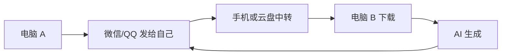

# 产品定位与用户痛点

## 一句话定位

FlowBridge 是面向 AI 创作者的跨设备工作流助手，让多台电脑像一台电脑一样连续工作。

## 最初痛点

用户同时使用工作电脑和 AI 电脑，但账号、网络、软件和资料分散在不同设备。发送一个 Prompt 或参考图，经常需要：

具体痛点：

1. 每天在多台设备和多个应用之间反复切换；
2. 文本、Prompt、图片和文档需要多次上传下载；
3. Prompt 与对应素材、模型、生成结果失去关联；
4. 历史内容难搜索，昨天有效的版本找不回来；
5. 工作资料通过个人社交软件中转，存在误发和隐私风险；
6. 普通传输工具只能“送达文件”，不能保留 AI 工作上下文。

## 核心用户

- AI 绘画、AI 视频和 AI 漫剧创作者；
- 同时使用办公本与高性能工作站的设计师；
- 在公司电脑与个人电脑间切换的产品经理；
- 高频使用 Prompt、参考图、生成结果和本地模型的人。

## 核心价值

| 价值 | 用户感知 |
|---|---|
| 少切换 | 不再打开微信、QQ、手机和网盘中转 |
| 快到达 | 文本快速发送，文件拖入后选择目标设备 |
| 能找回 | 剪贴板、Prompt 和传输记录可搜索 |
| 有上下文 | 逐步关联 Prompt、文件、设备和项目 |
| 可控制 | 明确目标设备、同步范围、状态与保留时间 |

## 产品边界

FlowBridge 不是社交软件、通用网盘、远程桌面或第一版就包办全部 AI 工具的平台。近期只聚焦“同一用户、多台可信设备、连续完成同一项 AI 工作”。

## 关联

- [[FlowBridge]]
- [[PRD V1.0 原始版]]
- [[需求演进与版本时间线]]

