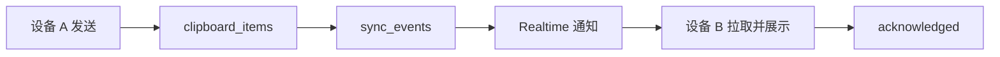
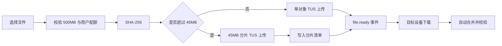

# 技术架构与 Supabase

## 客户端

- Electron 桌面壳；
- React + TypeScript + Vite；
- Zustand 本地状态；
- `contextIsolation: true`、`nodeIntegration: false`、sandbox 与白名单 IPC；
- Windows NSIS 安装包；
- 应用标识：`com.flowbridge.desktop`。

## 云端

- Supabase Auth：邮箱账号；
- Postgres：设备、剪贴板、传输、Prompt、个人资料、偏好、角色、配额和审计；
- Realtime：设备状态、文本和文件事件；
- 私有 Storage bucket：`flowbridge-files`；
- RLS：所有用户数据以 `auth.uid()` 隔离；
- 管理动作通过服务端 RPC 再次鉴权并写审计日志。

## 核心数据实体

- `devices`
- `clipboard_items`
- `transfers`
- `prompts`
- `projects`
- `sync_events`
- `profiles`
- `user_preferences`
- `user_roles`
- `storage_items`
- `storage_quotas`
- `audit_logs`

## 文本同步流程

## 文件传输流程

## 配置原则

- 客户端只允许放 Supabase URL 与 Publishable key；
- 禁止提交 Secret key 或 `service_role`；
- Publishable key 不是最终安全边界，真正边界是 RLS、对象路径所有权和服务端授权；
- 签名下载地址短时有效；
- 用户原文件名只存为元数据，不再直接用于 Storage key。

## 数据迁移

1. 新项目执行初始迁移；
2. 已有 V0.2 项目再执行 V0.3 平台迁移；
3. v0.3.1–v0.3.3 均为客户端修复，不需要重复执行 SQL。

## 关联

- [[故障复盘与经验]]
- [[双机安装与使用手册]]
- [[PRD V2.0 迭代版]]

