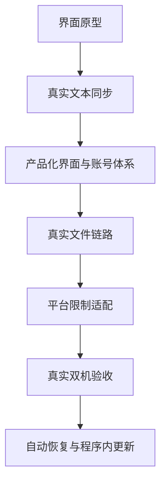

# 需求演进与版本时间线

## 2026-07-30：从想法到 V1.0 PRD

最初目标是做出第一版并上传 GitHub。V1.0 PRD 把产品定义为“AI 跨设备工作流助手”，MVP 重点是：

- 同一账号识别至少两台设备；
- 文本剪贴板同步；
- 文件发送与接收；
- Prompt 历史与搜索；
- 轻量项目上下文；
- Windows 优先。

第一版先完成了桌面界面和本地交互，但真实双机能力尚未闭环。这一阶段的重要认识是：**好看的页面不是跨设备产品的完成标准。**

## 2026-07-31：真实双机文本与 Supabase

用户明确提出“为什么第一版没有实现两机互传”。随后项目接入 Supabase：

- 创建 Supabase 项目；
- 使用项目 URL 与 Publishable key；
- 执行数据库迁移；
- 两台 Windows 使用同一账号、不同设备名登录；
- 建立设备心跳、Realtime 事件与双向文本同步；
- 发布 v0.2.0，并保留功能分支。

期间遇到邮箱确认链接跳到 `localhost:3000` 的问题，说明认证回调地址必须与真实客户端流程匹配。

## 2026-08-02：V2 PRD 与 v0.3 产品化升级

在真实文本同步成功后，需求从“能连接”升级到“能长期使用”：

- 页面像苹果产品一样简单、规整；
- 字体不能太小；
- 新增首页与个人主页；
- 支持主题、强调色、字号、密度、导航与首页组件设置；
- 加入云端存储、配额、文件生命周期；
- 加入用户、角色、设备、配额和审计管理后台；
- 真实文件上传、下载和 SHA-256 校验；
- 允许将可信账号设为超级管理员。

对应文档：[[PRD V2.0 迭代版]]。

## 2026-08-03：文件传输连续故障与修复

### v0.3.1：WebAssembly 被 CSP 拦截

- 表现：所有文件在上传前失败；
- 原因：`hash-wasm` 计算 SHA-256 时需要 WebAssembly，桌面端 CSP 禁止编译；
- 修复：仅加入更精确的 `wasm-unsafe-eval`，没有开放普通 JavaScript `unsafe-eval`。

### v0.3.2：Supabase Free 单对象 50MB 上限

- 表现：106.9MB 安装包返回 `413 Maximum size exceeded`；
- 原因：TUS 能断点续传，但仍受项目单对象大小限制；
- 修复：超过 45MB 自动分片，接收端自动合并并校验；
- 结果：软件对用户仍表现为一个原文件，目标仍为单文件最大 500MB。

### v0.3.3：中文文件名导致 Invalid key

- 表现：740KB JPG、893KB DOCX、1.9MB MP4 均返回 `400 Invalid key`；
- 原因：云端对象路径直接包含中文原文件名；
- 修复：内部对象路径改用 `file.jpg`、`file.docx`、`file.mp4` 等 ASCII 安全名，数据库与接收文件继续保留中文原名。

## 2026-08-04：V3 PRD 与 v0.4.0 稳定连接目标

实际双机使用继续暴露出“发送端上传成功，但接收端漏接”“连接短暂断开后不再恢复”“重试按钮只改界面状态”等问题。用户同时明确提出：

- 短暂断网后传输要自动恢复，不能丢任务；
- 接收端错过实时通知后仍要主动补收；
- 以后直接在程序内完成更新，不再每次手动下载安装包；
- 头像和壁纸支持自行上传；
- 页面不能再保留无效按钮。

代码核查确认：当前 Realtime 订阅缺少完整重连状态机，待接收事件只在启动时补拉，文件重试只改变本地状态，且项目尚无自动更新模块。因此 v0.4.0 被定义为可靠性版本，新增持久化传输队列、自动补拉、后台托盘接收、接收确认、版本兼容、程序内更新、头像壁纸与按钮审计。

对应文档：[[PRD V3.0 稳定连接版]]。

## 演进结论

下一阶段不应继续盲目增加功能，而应完成端到端测试、错误可读化、自动更新和可观测性。

## 关联

- [[交流摘要与决策日志]]
- [[故障复盘与经验]]
- [[发布与升级记录]]
